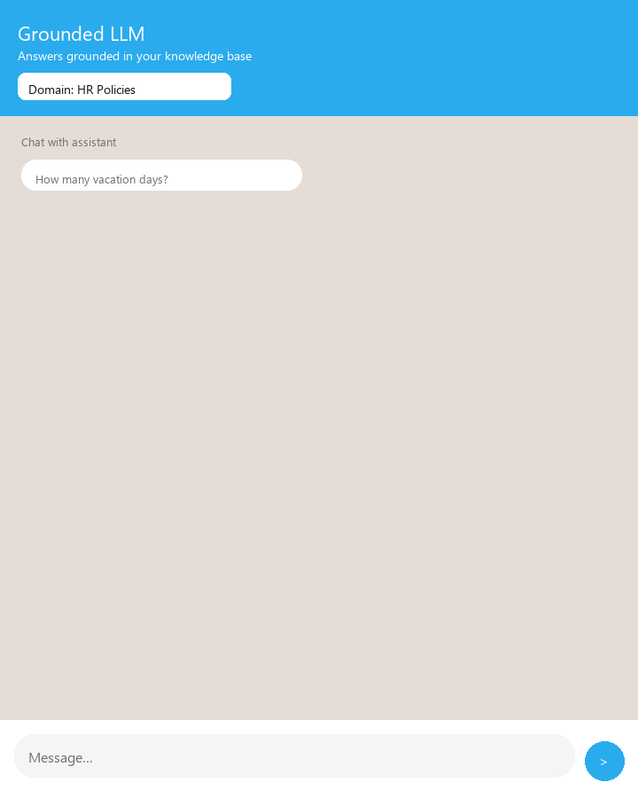
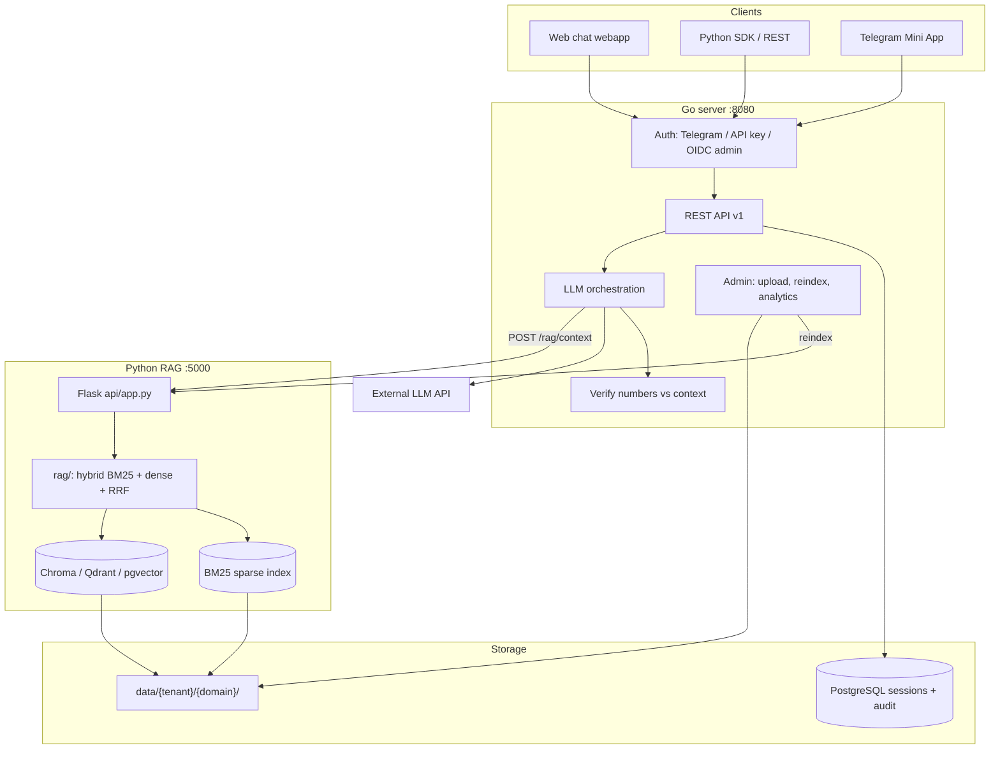

# Grounded LLM

[](https://github.com/kantik001/grounded-llm/actions/workflows/ci.yml)
[](https://github.com/kantik001/grounded-llm/releases/tag/v0.1.0)

**Open platform to deploy cited, verified document assistants in days — templates, API, on-prem.**



Grounded LLM is the **reference implementation** of an open spec for **document-grounded** assistants: answers come **only from your knowledge base**, with **source citations**, **numeric verification**, and **measurable retrieval quality**. Not a generic chatbot builder.

| | |
|---|---|
| **Cited RAG** | Every answer links to source documents |
| **Eval-driven quality** | **89** retrieval cases + adversarial gate in CI |
| **Enterprise-ready deploy** | Docker Compose, Helm, multi-tenant API, on-prem |

**Channels:** Web chat · REST API (`/api/v1`) · Telegram Mini App (optional) · [Landing](https://kantik001.github.io/grounded-llm/)

---

## Why this exists

Organizations cannot use public ChatGPT for internal policies and handbooks. They need assistants that stay **inside their infrastructure**, cite **their** documents, and **refuse to hallucinate** when the answer is not in the knowledge base.

Grounded LLM separates **orchestration** (Go: auth, sessions, LLM, verify) from **retrieval** (Python: hybrid search, pluggable vector backends) so teams can ship a new assistant from a **template pack** in days—not rebuild RAG from scratch.

---

## Architecture



**Message flow:** client → Go auth/session → Python hybrid retrieval → Go LLM → numeric verify → citations → Postgres.

**Numeric verify:** after the LLM answer, Go extracts numbers from the reply and checks each appears in retrieved context (±0.01). Answers with unsupported numbers are rejected. Details: [rag-verifier.md](docs/en/knowledge-base/rag-verifier.md).

| Layer | Path | Purpose |
|-------|------|---------|
| **Platform core** | `server/`, `api/`, `rag/`, `migrations/`, `webapp/` | Orchestration, retrieval, reference UI |
| **Template pack** | `config/`, `config/locales/{en,ru}/`, `data/{tenant}/{domain}/` | Prompts, branding, knowledge documents |

See [PLATFORM_VISION.md](PLATFORM_VISION.md) for positioning and [docs/en/ARCHITECTURE.md](docs/en/ARCHITECTURE.md) for details.

---

## Quick start

```bash
cp .env.example .env
# Set LLM_API_KEY (OpenAI-compatible). For local browser dev: TELEGRAM_AUTH_DISABLED=true

docker compose up -d --build
python scripts/reindex_rag.py
```

| Service | URL |
|---------|-----|
| Web App | http://localhost/ |
| Go API | http://localhost:8080/health |
| OpenAPI | http://localhost:8080/api/v1/openapi.json |

**New assistant from template:**

```bash
python scripts/init_pack.py list
python scripts/init_pack.py install it_support   # or: install hr
python scripts/reindex_rag.py
```

Legacy scaffold: `./scripts/init_domain.sh hr_policies default` (data dir only).

Reference templates: [HR](docs/en/domain-packs/HR.md) · [IT Support](docs/en/domain-packs/IT_SUPPORT.md) · [Legal FAQ](docs/en/domain-packs/LEGAL_FAQ.md) · [packs/registry.yaml](packs/registry.yaml)

**Python SDK (integrators):**

```bash
pip install -e "sdk/python[dev]"
grounded-llm chat "How many vacation days?" --domain default
```

Guide: [docs/en/QUICKSTART_SDK.md](docs/en/QUICKSTART_SDK.md) · Example: [examples/python/chat_basic.py](examples/python/chat_basic.py)

---

## API highlights

- `GET /domains` — domain catalog
- `POST /session`, `GET /history`, `POST /message` — chat (`domain_id` in JSON)
- `POST /message?stream=1` — SSE streaming
- `GET /branding`, `GET /onboarding` — locale via `X-Locale`, `?locale=`, `Accept-Language`
- Admin: upload, reindex, index stats, feedback summary
- Integrators: `X-API-Key` + `X-Tenant-ID`, OpenAPI at `/api/v1/openapi.json`

Examples: [docs/en/API_EXAMPLES.md](docs/en/API_EXAMPLES.md)

---

## Quality and security

```bash
make test                      # Go + Python unit tests (~78 pytest + Go)
make eval-retrieval-ci         # Full retrieval gate (reindex + eval, same as CI)
make eval-retrieval            # RAG baseline only (needs Python already on :5000)
python -m conformance spec     # Offline OpenAPI / spec check
```

- **CI:** `eval-retrieval-gate` runs **89 retrieval cases** (HR, IT, Legal, adversarial, hybrid) on every push/PR — see [BENCHMARK.md](docs/en/BENCHMARK.md)
- **Unit tests:** hybrid/RRF, pgvector, connectors, verifier — `tests/`
- **Security:** gitleaks, CodeQL, [SECURITY_BRIEF.md](docs/en/SECURITY_BRIEF.md)

---

## Documentation

| Doc | Description |
|-----|-------------|
| [PLATFORM_VISION.md](PLATFORM_VISION.md) | What we are (and are not) |
| [docs/en/QUICKSTART_SDK.md](docs/en/QUICKSTART_SDK.md) | SDK + CLI in 5 minutes |
| [docs/en/COMPARISON.md](docs/en/COMPARISON.md) | vs alternatives (honest) |
| [docs/en/CASE_STUDY_HR_PILOT.md](docs/en/CASE_STUDY_HR_PILOT.md) | HR pilot KPI template |
| [docs/en/K8S_DEPLOY.md](docs/en/K8S_DEPLOY.md) | Helm / Kubernetes deploy |
| [docs/en/TRUST_CENTER.md](docs/en/TRUST_CENTER.md) | Security review summary |
| [docs/en/BACKUP_RESTORE.md](docs/en/BACKUP_RESTORE.md) | Postgres, Chroma, data backup |
| [docs/en/PHASE_4.md](docs/en/PHASE_4.md) | Spec, conformance, tenant purge |
| [docs/en/PHASE_5.md](docs/en/PHASE_5.md) | Standard publication (Spec v1, site) |
| [docs/en/CONNECTORS.md](docs/en/CONNECTORS.md) | SharePoint, Drive, Confluence ingest |
| [docs/en/SAAS.md](docs/en/SAAS.md) · [BILLING.md](docs/en/BILLING.md) | Optional hosted signup + Stripe |
| [docs/en/LAUNCH.md](docs/en/LAUNCH.md) | Public launch playbook |
| [docs/en/ROADMAP.md](docs/en/ROADMAP.md) | Phases 1–11 complete; what's next |
| [docs/en/STANDARD_STRATEGY.md](docs/en/STANDARD_STRATEGY.md) | Horizons, pillars, path A→B |
| [docs/en/spec/GROUNDED_SPEC_v1.md](docs/en/spec/GROUNDED_SPEC_v1.md) | Normative API v1 spec |
| [docs/en/RFC.md](docs/en/RFC.md) | RFC process · [RFC-0001](docs/en/rfcs/RFC-0001-grounded-compatible.md) |
| [docs/en/ECOSYSTEM.md](docs/en/ECOSYSTEM.md) | Standard core vs agents (separate project) |
| [docs/en/BENCHMARK.md](docs/en/BENCHMARK.md) | Public eval metrics (89 retrieval cases) |
| [docs/en/RELEASE.md](docs/en/RELEASE.md) | Tag & release checklist (v0.1.0) |
| [Site (GitHub Pages)](https://kantik001.github.io/grounded-llm/) | Spec, conformance, quick start |
| [docs/en/API_DEPRECATION_POLICY.md](docs/en/API_DEPRECATION_POLICY.md) | `/api/v1` stability & sunset |
| [docs/en/COMPATIBILITY.md](docs/en/COMPATIBILITY.md) | Supported stack matrix |
| [conformance/](conformance/) | API + retrieval conformance tests |
| [docs/en/](docs/en/) | Architecture, deploy, roadmap, templates |
| [docs/ru/](docs/ru/) | Russian docs (legacy locale) |
| [GOOD_FIRST_ISSUES.md](GOOD_FIRST_ISSUES.md) | Starter contributions |
| [CONTRIBUTING.md](CONTRIBUTING.md) | How to contribute |
| [SECURITY.md](SECURITY.md) | Security policy and vulnerability reporting |
| [CHANGELOG.md](CHANGELOG.md) | Release history |

Design decisions and architecture trade-offs: [HIRING.md](HIRING.md)

---

## Contributing

Contributions are welcome. See [CONTRIBUTING.md](CONTRIBUTING.md) and [CODE_OF_CONDUCT.md](CODE_OF_CONDUCT.md).

Report security issues privately via [SECURITY.md](SECURITY.md) — not public issues.

---

## Maintainer

**Kantemir Satibalov** — [GitHub @kantik001](https://github.com/kantik001)

If Grounded LLM saves your team time, [sponsor the project](https://github.com/sponsors/kantik001) (optional — helps fund maintenance and the public standard).

---

## License

MIT — see [LICENSE](LICENSE).
