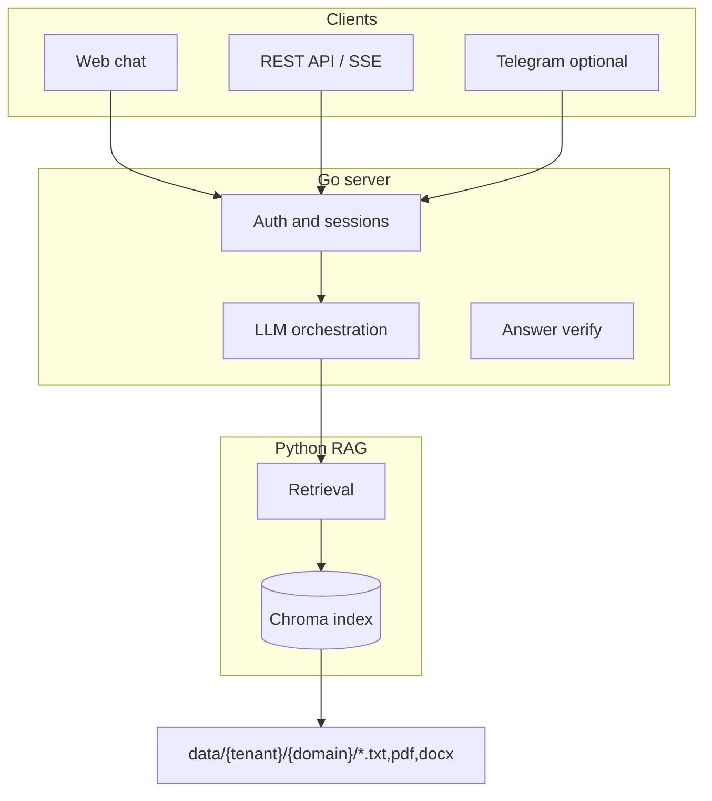

# Grounded LLM

[](https://github.com/kantik001/grounded-llm/actions/workflows/ci.yml)

**Open platform to deploy cited, verified document assistants in days — templates, API, on-prem.**

Grounded LLM is a production-oriented platform for **document-grounded** assistants: answers come **only from your knowledge base**, with **source citations**, **numeric verification**, and **measurable retrieval quality**. Not a generic chatbot builder.

| | |
|---|---|
| **Cited RAG** | Every answer links to source documents |
| **Eval-driven quality** | JSONL baselines + **retrieval gate in CI** |
| **Enterprise-ready deploy** | Docker Compose, multi-tenant API, on-prem |

**Channels:** Web chat · REST API (`/api/v1`) · Telegram Mini App (optional)

---

## Why this exists

Organizations cannot use public ChatGPT for internal policies and handbooks. They need assistants that stay **inside their infrastructure**, cite **their** documents, and **refuse to hallucinate** when the answer is not in the knowledge base.

Grounded LLM separates **orchestration** (Go: auth, sessions, LLM, verify) from **retrieval** (Python: embeddings, Chroma) so teams can ship a new assistant from a **template pack** in days—not rebuild RAG from scratch.

---

## Architecture



| Layer | Path | Purpose |
|-------|------|---------|
| **Platform core** | `server/`, `api/`, `rag/`, `migrations/`, `webapp/` | Orchestration, retrieval, reference UI |
| **Template pack** | `config/`, `config/locales/{en,ru}/`, `data/{tenant}/{domain}/` | Prompts, branding, knowledge documents |

See [PLATFORM_VISION.md](PLATFORM_VISION.md) for positioning and [docs/en/ARCHITECTURE.md](docs/en/ARCHITECTURE.md) for details.

---

## Quick start

```bash
cp .env.example .env
# Set LLM_API_KEY (OpenAI-compatible). For local browser dev: TELEGRAM_AUTH_DISABLED=true

docker compose up -d --build
python scripts/reindex_rag.py
```

| Service | URL |
|---------|-----|
| Web App | http://localhost/ |
| Go API | http://localhost:8080/health |
| OpenAPI | http://localhost:8080/api/v1/openapi.json |

**New assistant from template:**

```bash
./scripts/init_domain.sh hr_policies default
# 1. Add entry to config/domains.json
# 2. Add documents under data/default/hr_policies/
# 3. Tune config/locales/en/ (prompts, branding, onboarding)
# 4. python scripts/reindex_rag.py
```

Reference template: [HR domain pack](docs/en/domain-packs/HR.md) · [domain-pack-template/](domain-pack-template/)

---

## API highlights

- `GET /domains` — domain catalog
- `POST /session`, `GET /history`, `POST /message` — chat (`domain_id` in JSON)
- `POST /message?stream=1` — SSE streaming
- `GET /branding`, `GET /onboarding` — locale via `X-Locale`, `?locale=`, `Accept-Language`
- Admin: upload, reindex, index stats, feedback summary
- Integrators: `X-API-Key` + `X-Tenant-ID`, OpenAPI at `/api/v1/openapi.json`

Examples: [docs/en/API_EXAMPLES.md](docs/en/API_EXAMPLES.md)

---

## Quality and security

```bash
make test                    # Go + Python unit tests
make eval-retrieval-ci         # Full retrieval gate (reindex + eval, same as CI)
make eval-retrieval            # RAG baseline only (needs Python already on :5000)
```

- **CI:** `eval-retrieval-gate` runs all suites (EN 18 + RU 12) on every push/PR
- Eval suites: `eval/rag_default_en_baseline.jsonl`, `eval/rag_default_baseline.jsonl`
- Security overview: [docs/en/SECURITY_BRIEF.md](docs/en/SECURITY_BRIEF.md)

---

## Documentation

| Doc | Description |
|-----|-------------|
| [PLATFORM_VISION.md](PLATFORM_VISION.md) | What we are (and are not) |
| [HIRING.md](HIRING.md) | Design decisions and interview talking points |
| [docs/en/](docs/en/) | Architecture, deploy, roadmap, templates |
| [docs/ru/](docs/ru/) | Russian docs (legacy locale) |

---

## Author

Built by **Kantemir Satibalov** — platform engineer focused on production RAG systems.

Open to **LLM / RAG / Platform Engineer** roles worldwide (remote and relocation to Canada, USA, Australia, New Zealand).

- Portfolio narrative: [HIRING.md](HIRING.md)
- LinkedIn: *(add your profile URL)*

---

## License

MIT — see [LICENSE](LICENSE).
