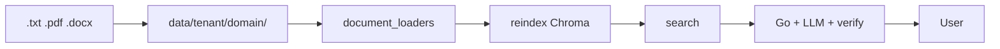

# Knowledge base data pipeline

**Goal:** how documents reach RAG and become chat answers.

---

## RAG: document to answer



| Stage | Where |
|-------|-------|
| File upload | admin `POST /admin/upload` or git → `data/{tenant_id}/{domain_id}/` |
| Parsing | `rag/document_loaders.py` |
| Chunk + embed | `rag/vector_store.py` |
| Retrieval | `POST /rag/context` |
| Answer | `server/rag_pipeline.go` |

---

## Supported formats

| Format | Notes |
|--------|-------|
| `.txt` | UTF-8 |
| `.pdf` | text layer (PyPDF) |
| `.docx` | Word (docx2txt) |

Admin upload filename: **Latin** letters, digits, `_`, `-`, up to **10 MB**.

---

## Step 1 — prepare documents

```
data/default/default/policy_vacation.txt
data/default/default/handbook.pdf
data/acme/legal/contract_template.docx
```

Demo domain `default`: HR policies in `data/default/default/` (legacy `data/default/` also works).

---

## Step 2 — reindex

```bash
python scripts/reindex_rag.py
```

Or admin: `POST /admin/reindex` (Go → Python with `ADMIN_SECRET`).

Without reindex new files **do not** enter Chroma.

---

## Step 3 — verify

```bash
python scripts/run_rag_eval.py --suite default
```

Or manually: `POST /rag/context` with `domain_id`, `tenant_id`, `locale`, and `question`.

---

## CV / Vision (optional)

Photo recognition **is not** in platform core. Vision requires a separate domain pack (own repo or service).

---

## What to read next

| Topic | File |
|-------|------|
| Admin upload | [server-admin-and-ux-api.md](./server-admin-and-ux-api.md) |
| Vector store | [rag-vector_store.md](./rag-vector_store.md) |
| Deploy | [../DEPLOY.md](../DEPLOY.md) |
