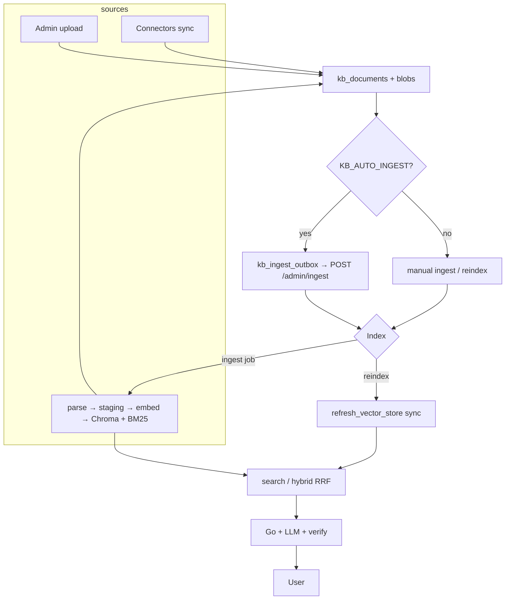

# Knowledge base data pipeline

**Goal:** how documents reach RAG and become chat answers.

Deep dive (async ingest): [INGESTION.md](../INGESTION.md) · document registry: [KB_SOURCE_OF_TRUTH.md](../KB_SOURCE_OF_TRUTH.md) · legacy full sync: [config/REINDEX.md](../../config/REINDEX.md)

---

## Two paths to index documents

| Path | When to use |
|------|-------------|
| **Ingest pipeline** (new) | Production admin flow: job queue, per-file parse → embed → index, status API |
| **Reindex** (legacy) | Dev/CI, full or incremental sync in one shot (`reindex_rag.py`, `POST /admin/reindex`) |

Both reuse the same parsers, chunker, embeddings, and Chroma manifest semantics.

---

## RAG: document to answer


```mermaid
flowchart TB
    subgraph sources
        U[Admin upload]
        C[Connectors sync]
        P[Pack install]
    end
    U --> REG[kb_documents + blobs]
    C --> REG
    P --> REG
    REG --> O{KB_AUTO_INGEST?}
    O -->|yes| OB[kb_ingest_outbox → POST /admin/ingest]
    O -->|no| MAN[manual ingest / reindex]
    OB --> I{Index}
    MAN --> I
    I -->|ingest job| P[parse → staging → embed → Chroma + BM25]
    I -->|reindex| R[refresh_vector_store sync]
    P --> S[search / hybrid RRF]
    R --> S
    S --> A[Go + LLM + verify]
    A --> User[User]
```

| Stage | Where |
|-------|-------|
| **Source of truth** | Postgres `kb_documents` + blobs (`KB_BLOB_DIR` or S3) — see [KB_SOURCE_OF_TRUTH.md](../KB_SOURCE_OF_TRUTH.md) |
| **Auto-ingest** | `KB_AUTO_INGEST=1` → outbox flush after upload/connector (`kb_ingest_outbox`) |
| **Ingest (async)** | `POST /admin/ingest` → `ingest_jobs` → discover registry → Redis → `ingest-worker` |
| **Reindex (sync fallback)** | `python scripts/reindex_rag.py` or `POST /admin/reindex` |
| Load + parse | `rag/document_loaders.py` |
| Chunk | `rag/indexing.py` (500 tokens / overlap 50, stable `chunk_id`) |
| Embed | `CachedHuggingFaceEmbeddings` (e5-small + Redis cache) |
| Dense index | Chroma / Qdrant / pgvector (`rag/vector_backend/`) |
| Sparse index | BM25 (`rag/sparse_index.py`) when `RAG_RETRIEVAL_MODE=hybrid` |
| Retrieval | `POST /rag/context` |
| Answer | `internal/rag/pipeline.go` |

---

## Ingest pipeline (recommended for admin)

```bash
# Async (needs ingest-worker in Compose)
curl -u admin:pass -X POST "http://localhost:8080/api/admin/ingest?domain_id=default" \
  -H "Content-Type: application/json" \
  -d '{"files": [], "mode": "incremental", "sync": false}'

curl -u admin:pass "http://localhost:8080/api/admin/ingest/status?job_id=1"
```

- Empty `files` = all active documents in the domain (from Postgres registry).
- `sync: true` = week-1 style: process entire job in one Python call (no Redis worker).
- Job states: `queued → parsing → embedding → indexing → succeeded | failed | partial`.

See [INGESTION.md](../INGESTION.md).

---

## Supported formats

| Format | Notes |
|--------|-------|
| `.txt` | UTF-8 |
| `.pdf` | text layer (PyPDF) |
| `.docx` | Word (docx2txt) |

Admin upload filename: **Latin** letters, digits, `_`, `-`, up to **10 MB**.

---

## Step 1 — prepare documents

**Production:** upload via admin UI/API (registry + blob) or connector sync / pack install.

**Migration:** existing files under git-tracked `data/` → `python scripts/backfill_kb_registry.py` (once).

Demo domain `default`: HR policies in `packs/default/data/` — registered on `init_pack.py install`.

---

## Step 2 — index

**Production (ingest):**

```bash
docker compose up -d ingest-worker
# then POST /admin/ingest (see above)
```

**Dev / CI (reindex):**

```bash
python scripts/reindex_rag.py
# or POST /admin/reindex (Go job → Python incremental refresh)
```

Without indexing, new files **do not** enter the vector store.

---

## Step 3 — verify

```bash
python scripts/run_rag_eval.py --suite default
```

Or manually: `POST /rag/context` with `domain_id`, `tenant_id`, `locale`, and `question`.

---

## CV / Vision (optional)

Photo recognition **is not** in platform core. Vision requires a separate domain pack (own repo or service).

---

## What to read next

| Topic | File |
|-------|------|
| Source of truth | [KB_SOURCE_OF_TRUTH.md](../KB_SOURCE_OF_TRUTH.md) |
| Ingestion jobs | [INGESTION.md](../INGESTION.md) |
| Admin upload + APIs | [server-admin-and-ux-api.md](./server-admin-and-ux-api.md) |
| Vector store | [rag-vector_store.md](./rag-vector_store.md) |
| Connectors → data/ | [CONNECTORS.md](../CONNECTORS.md) |
| Deploy | [../DEPLOY.md](../DEPLOY.md) |
