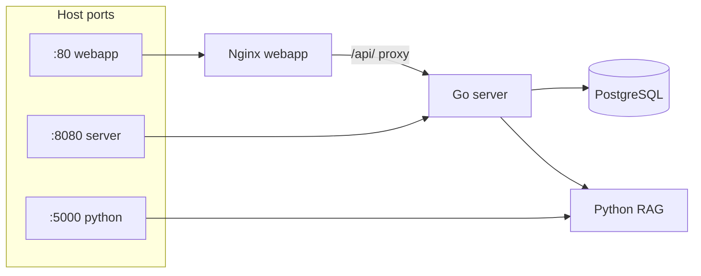

# Docker and local run

**Files:** `docker-compose.yml`, `Dockerfile.server`, `Dockerfile.python`, `Dockerfile.webapp`, `.env`  
**See also:** [server-overview.md](./server-overview.md), [webapp-overview.md](./webapp-overview.md)

---

## Four services



| Service | Image | Role |
|---------|-------|------|
| **postgres** | `postgres:16-alpine` | users, sessions, messages, feedback, analytics |
| **python** | `Dockerfile.python` | Flask: RAG retrieval, reindex, `/health` |
| **server** | `Dockerfile.server` | API, LLM orchestration, verify, admin |
| **webapp** | `Dockerfile.webapp` | Reference UI (Telegram Web App) + nginx → server |

Compose project name: **`grounded_llm`** (`name:` in `docker-compose.yml`, `PROJECT_NAME` in `Makefile`).

---

## Quick start

```bash
cp .env.example .env   # LLM_API_KEY, ADMIN_PASSWORD, TELEGRAM_BOT_TOKEN
docker compose up -d --build
python scripts/reindex_rag.py   # or POST /admin/reindex
```

Useful commands:

```bash
docker compose ps
docker compose logs -f server
docker compose logs -f python
docker compose restart server
docker compose up -d --force-recreate server
docker compose down
docker compose down -v   # removes volumes: DB, chroma, uploads!
```

Makefile: `make up`, `make logs`, `make smoke`, `make test`.

---

## Volumes

| Volume | Container | Content |
|--------|-----------|---------|
| `postgres_data` | postgres | chat schema and data |
| `chroma_data` | python `/app/chroma_db` | RAG index (Chroma) |
| `uploads_data` | server `/data/uploads` | reserved for domain pack media |

**Bind mounts from host:**

| Host | Container | Purpose |
|------|-----------|---------|
| `./data` | python `:ro`, server `/app/data` rw | KB docs (`.txt`, `.pdf`, `.docx`) |
| `./config` | server + python `/config:ro` | domains, locales |
| `./api`, `./rag` | python `:ro` | dev without image rebuild |
| `./webapp/*` | webapp | UI without rebuild |

---

## Service `postgres`

- User / password / db: `grounded` / `grounded` / `grounded`
- `DATABASE_URL` in server matches compose
- Healthcheck `pg_isready` — server starts after DB

---

## Service `python` (RAG)

- Port **5000**, entrypoint: `python api/app.py`
- Env: `DOMAINS_CONFIG_PATH`, `LOCALES_ROOT`, `DEFAULT_LOCALE`, `ADMIN_SECRET`, `FORCE_RAG_REINDEX`, `PYTHON_SERVICE_PORT`
- Healthcheck: `start_period: 180s` (first RAG / embeddings can be slow)
- Endpoints: `/health`, `/rag/context`, `/domains`, `/admin/reindex`

First RAG request may download embedding model `intfloat/multilingual-e5-small`.

---

## Service `server`

- Port **8080**
- Depends on healthy `postgres` + `python`
- Image: binary `main`, `/migrations`, `/config` (runtime override via volume)
- `DATA_DIR=/app/data` — admin KB upload
- `MIGRATIONS_DIR=/migrations` — SQL on startup
- `LOCALES_ROOT=/config/locales`, `DEFAULT_LOCALE`

Dev without Telegram:

```env
TELEGRAM_AUTH_DISABLED=true
```

---

## Service `webapp`

- Port **80** → http://localhost/
- `index.html` — chat, `admin.html` — admin
- `location /api/` → proxy `http://server:8080/`

---

## Network between containers

| From | URL |
|------|-----|
| server | `http://python:5000/rag/context` |
| webapp nginx | `http://server:8080` |
| server | `postgres:5432` |

From host: `localhost:8080` (Go direct), `localhost/api/` (via nginx).

---

## Dockerfiles

| File | Base | Notes |
|------|------|-------|
| `Dockerfile.server` | `golang:1.23-alpine` → `alpine:3.21` | multi-stage, `curl` for healthcheck |
| `Dockerfile.python` | `python:3.11-slim` | RAG deps from `api/requirements.txt` |
| `Dockerfile.webapp` | `nginx:alpine` | static + `nginx.conf` |

---

## Common issues

| Problem | Fix |
|---------|-----|
| python unhealthy 2–3 min | normal on first start; check `docker compose logs python` |
| server unhealthy | wait for postgres/python; `docker compose logs server` |
| new docs not in RAG | upload + `POST /admin/reindex` or `scripts/reindex_rag.py` |
| `config/` changes | volume `./config`; Go: `docker compose kill -s HUP server` or `CONFIG_RELOAD_INTERVAL_SEC` |
| 401 in chat | `TELEGRAM_AUTH_DISABLED=true` + recreate server |
| stale Python image | `docker compose build --no-cache python && docker compose up -d --force-recreate python server` |

---

## CI vs local Docker

GitHub Actions builds all three images but does **not** start full compose. See [github-ci.yml.md](./github-ci.yml.md).
