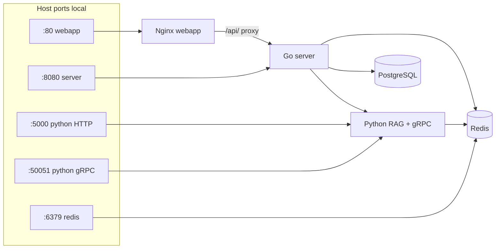

# Docker and local run

**Files:** `docker-compose.yml`, `Dockerfile.server`, `Dockerfile.python`, `Dockerfile.webapp`, `.env`  
**See also:** [server-overview.md](./server-overview.md), [webapp-overview.md](./webapp-overview.md)

---

## Services


```mermaid
flowchart LR
    subgraph host [Host ports local]
        P80[":80 webapp"]
        P8080[":8080 server"]
        P5000[":5000 python HTTP"]
        P50051[":50051 python gRPC"]
        P6379[":6379 redis"]
    end
    webapp[Nginx webapp]
    server[Go server]
    python[Python RAG + gRPC]
    redis[(Redis)]
    db[(PostgreSQL)]

    P80 --> webapp
    webapp -->|/api/ proxy| server
    P8080 --> server
    server --> db
    server --> python
    server --> redis
    python --> redis
    P5000 --> python
    P50051 --> python
    P6379 --> redis
```

| Service | Image | Role |
|---------|-------|------|
| **postgres** | `pgvector/pgvector:pg16` | users, sessions, messages, feedback, analytics; optional pgvector |
| **redis** | `redis:7-alpine` | embedding cache + semantic LLM response cache |
| **python** | `Dockerfile.python` | Gunicorn HTTP RAG (`:5000`) + gRPC Retriever (`:50051`); Flask app module |
| **server** | `Dockerfile.server` | API, LLM orchestration, verify, admin, `/metrics` |
| **webapp** | `Dockerfile.webapp` | Reference UI + nginx → server |
| **ollama** / **vllm** | optional profiles | Local OpenAI-compatible LLM (`--profile ollama` / `vllm`) |
| **guardrails** (optional) | sibling `docker-compose.guardrails.yml` | [grounded-guardrails](https://github.com/kantik001/grounded-guardrails) gRPC `:50052` — [GUARDRAILS.md](../GUARDRAILS.md) |

Compose project name: **`grounded_llm`** (`name:` in `docker-compose.yml`, `PROJECT_NAME` in `Makefile`).

Local LLM / caches: [LLM_PROVIDERS.md](../LLM_PROVIDERS.md).  
Optional remote verify: [GUARDRAILS.md](../GUARDRAILS.md).

---

## Quick start

```bash
cp .env.example .env   # LLM_API_KEY or LLM_PROVIDER=ollama, ADMIN_PASSWORD, TELEGRAM_BOT_TOKEN
docker compose up -d --build
# Optional: docker compose --profile ollama up -d
# Optional remote verify (sibling repo grounded-guardrails):
# docker compose -f docker-compose.yml -f docker-compose.guardrails.yml up -d --build
python scripts/reindex_rag.py   # dev/CI sync
# POST /api/admin/ingest        # production async (see INGESTION.md)
# POST /admin/reindex           # legacy incremental job
```

Useful commands:

```bash
docker compose ps
docker compose logs -f server
docker compose logs -f python
docker compose restart server
docker compose up -d --force-recreate server
docker compose down
docker compose down -v   # removes volumes: DB, chroma, uploads!
```

Makefile: `make up`, `make logs`, `make smoke`, `make test`.

---

## Volumes

| Volume | Container | Content |
|--------|-----------|---------|
| `postgres_data` | postgres | chat schema and data |
| `chroma_data` | python `/app/chroma_db` | RAG index (Chroma) |
| `uploads_data` | server `/data/uploads` | reserved for domain pack media |

**Bind mounts from host:**

| Host | Container | Purpose |
|------|-----------|---------|
| `./data` | python `:ro`, server `/app/data` rw | KB docs (`.txt`, `.pdf`, `.docx`) |
| `./config` | server + python `/config:ro` | domains, locales |
| `./api`, `./rag` | python `:ro` | dev without image rebuild |
| `./webapp/*` | webapp | UI without rebuild |

---

## Service `postgres`

- User / password / db: `grounded` / `grounded` / `grounded`
- `DATABASE_URL` in server matches compose
- Healthcheck `pg_isready` — server starts after DB

---

## Service `python` (RAG)

- Ports **5000** (HTTP) and **50051** (gRPC); `tini` + `api/entrypoint.sh` (Gunicorn + gRPC side-by-side)
- Env: `DOMAINS_CONFIG_PATH`, `LOCALES_ROOT`, `DEFAULT_LOCALE`, `ADMIN_SECRET`, `FORCE_RAG_REINDEX`, `PYTHON_SERVICE_PORT`, `PYTHON_GRPC_PORT`, `REDIS_URL`, `RAG_SERVICE_TOKEN`
- Healthcheck: `start_period: 180s` (first RAG / embeddings can be slow)
- HTTP: `/health`, `/ready`, `/metrics`, `/rag/context`, `/domains`, `/admin/reindex`, `/admin/ingest/*`
- gRPC: `grounded.rag.v1.Retriever/Retrieve` (+ health)

First RAG request may download embedding model `intfloat/multilingual-e5-small`.

---

## Service `ingest-worker`

- Command: `python -m workers.ingest_worker` (polls Redis parse/embed/finalize queues)
- Shares `chroma_data`, `data/`, `DATABASE_URL`, `REDIS_URL`, `KB_BLOB_*` with `python`
- Discovers documents from Postgres registry only
- Scale: `docker compose up -d --scale ingest-worker=2`
- See [INGESTION.md](../INGESTION.md) · [KB_SOURCE_OF_TRUTH.md](../KB_SOURCE_OF_TRUTH.md)

---

## Optional service `minio` (S3-compatible blobs)

```bash
docker compose --profile minio up -d
```

Set on `server`, `python`, `ingest-worker`: `KB_BLOB_BACKEND=s3`, `KB_S3_ENDPOINT=minio:9000`, `KB_S3_ACCESS_KEY`, `KB_S3_SECRET_KEY`, `KB_S3_BUCKET=grounded-kb`.

---

## Service `server`

- Port **8080**
- Depends on healthy `postgres` + `python`
- Image: binary `main`, `/migrations`, `/config` (runtime override via volume)
- `DATA_DIR=/app/data` — optional path (chat uploads / misc); KB SoT is Postgres + blobs
- `KB_BLOB_BACKEND`, `KB_BLOB_DIR`, `KB_S3_*` — document blob store
- `MIGRATIONS_DIR=/migrations` — SQL on startup
- `LOCALES_ROOT=/config/locales`, `DEFAULT_LOCALE`

Dev without Telegram:

```env
TELEGRAM_AUTH_DISABLED=true
```

---

## Service `webapp`

- Port **80** → http://localhost/
- `index.html` — chat, `admin.html` — admin
- `location /api/` → proxy `http://server:8080/`

---

## Network between containers

| From | URL |
|------|-----|
| server | `http://python:5000/rag/context` |
| server | `REDIS_URL` → `redis://redis:6379/0` |
| webapp nginx | `http://server:8080` |
| server | `postgres:5432` |
| agents (optional) | `python:50051` gRPC Retriever |
| guardrails (optional) | sibling compose override → `:50052` — [GUARDRAILS.md](../GUARDRAILS.md) |

From host: `localhost:8080` (Go), `localhost/api/` (via nginx), `127.0.0.1:5000` / `:50051` / `:6379` (loopback only in local compose); optional `:50052` with guardrails override.

---

## Dockerfiles

| File | Base | Notes |
|------|------|-------|
| `Dockerfile.server` | `golang:1.25-alpine` → `alpine:3.21` | multi-stage, `curl` for healthcheck |
| `Dockerfile.python` | `python:3.11-slim` | `tini` + Gunicorn + gRPC via `api/entrypoint.sh` |
| `Dockerfile.webapp` | `nginx:alpine` | static + `nginx.conf` |

---

## Common issues

| Problem | Fix |
|---------|-----|
| python unhealthy 2–3 min | normal on first start; check `docker compose logs python` |
| server unhealthy | wait for postgres/python; `docker compose logs server` |
| new docs not in RAG | upload + `POST /admin/ingest` (or `ingest-worker` running) · fallback: `reindex_rag.py` |
| `config/` changes | volume `./config`; Go: `docker compose kill -s HUP server` or `CONFIG_RELOAD_INTERVAL_SEC` |
| 401 in chat | `TELEGRAM_AUTH_DISABLED=true` + recreate server |
| stale Python image | `docker compose build --no-cache python && docker compose up -d --force-recreate python server` |

---

## CI vs local Docker

GitHub Actions builds all three images but does **not** start full compose. See [github-ci.yml.md](./github-ci.yml.md).
