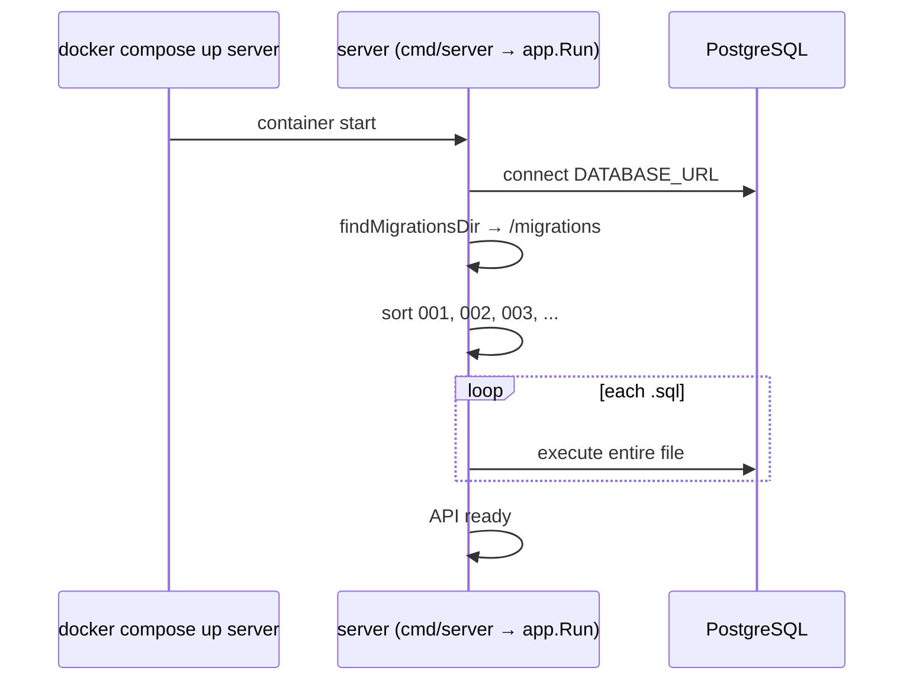

# PostgreSQL migrations (`migrations/*.sql`)

**Folder:** `migrations/` — see also [`migrations/README.md`](../../../migrations/README.md)  
**Applied by:** Go server on startup (`internal/app/main.go` → `store.RunAllMigrations` in `internal/store/postgres_store.go`)  
**DB:** PostgreSQL 16 (Compose service `postgres`)

---

## What is a migration

A **migration** is an SQL script that **changes database structure** (tables, columns, indexes).

Why not edit the DB manually:

- same schema locally, for teammates, and in production;
- changes tracked in Git;
- on deploy the server applies scripts automatically.

Files are numbered in order — schema evolution, not multiple databases.

---

## How migrations run in this project


```mermaid
sequenceDiagram
    participant DC as docker compose up server
    participant Go as server (cmd/server → app.Run)
    participant PG as PostgreSQL

    DC->>Go: container start
    Go->>PG: connect DATABASE_URL
    Go->>Go: findMigrationsDir → /migrations
    Go->>Go: sort 001, 002, 003, ...
    loop each .sql
        Go->>PG: execute entire file
    end
    Go->>Go: API ready
```

### Important details

1. Table **`schema_migrations`** — each `.sql` applied **once**.
2. Scripts use **`IF NOT EXISTS`** / **`ADD COLUMN IF NOT EXISTS`** for safe recovery.

### Docker paths

- `Dockerfile.server`: `COPY migrations /migrations`
- `docker-compose.yml`: `MIGRATIONS_DIR=/migrations`

Locally without Docker Go finds `migrations` or `../migrations`.

---

## `001_init.sql` — foundation

Three tables + relations.

### `users` — chat participants

| Column | Purpose |
|--------|---------|
| `id` | internal DB id |
| `telegram_id` | Telegram id, **UNIQUE** |
| `username`, `first_name`, `last_name` | profile |
| `created_at`, `updated_at` | timestamps |

### `chat_sessions` — one “dialog”

| Column | Purpose |
|--------|---------|
| `id` | TEXT (random hex from Go) |
| `user_id` | → `users.id`, CASCADE on user delete |
| `created_at`, `updated_at` | session timestamps |

Index `idx_chat_sessions_user_id` — list sessions per user.

### `messages` — messages in a session

| Column | Purpose |
|--------|---------|
| `id` | BIGSERIAL |
| `session_id` | → `chat_sessions.id` |
| `role` | `user` or `assistant` |
| `content` | text |
| `kind` | message type |
| `image_token` | file reference (domain pack / vision) |
| `class_prediction`, `class_confidence` | optional for vision domain pack |
| `created_at` | chat order |

Index `(session_id, created_at)` — history by time.

---

## `002_domain_id.sql` — session domain

Adds `domain_id` to `chat_sessions`:

```sql
ALTER TABLE chat_sessions
    ADD COLUMN IF NOT EXISTS domain_id TEXT NOT NULL DEFAULT 'default';

CREATE INDEX IF NOT EXISTS idx_chat_sessions_domain_id ON chat_sessions (domain_id);
```

Each session is tied to a knowledge domain from `config/domains.json`.

---

## `003_feedback_analytics.sql` — UX and metrics

### `message_feedback` — thumbs up / down

| Column | Purpose |
|--------|---------|
| `message_id` | → `messages.id`, CASCADE |
| `user_id` | → `users.id` |
| `rating` | `-1` or `1` |
| `UNIQUE (message_id, user_id)` | one vote per user per message |

### `analytics_events` — product events

| Column | Purpose |
|--------|---------|
| `event_type` | event code string |
| `payload` | JSONB |
| `user_id` | optional, SET NULL if user deleted |

---

## `005_message_citations.sql` — source excerpts

Adds `citations JSONB` to assistant `messages` for UI source cards.

---

## `006_tenant_id.sql` — multi-tenant

Adds `tenant_id` to `chat_sessions` (default `'default'`) for workspace isolation.

---

## `007_audit_log.sql` — admin audit trail

Table **`audit_log`** — append-only admin events:

| Column | Purpose |
|--------|---------|
| `action` | `admin_login`, `admin_login_failed`, `kb_upload`, `kb_delete`, `kb_reindex` |
| `actor` | Admin username (Basic Auth) |
| `tenant_id`, `domain_id`, `resource` | Context (filename for KB ops) |
| `client_ip`, `request_id` | Traceability |
| `success` | Outcome |
| `details` | JSONB (e.g. error message, file size) |

Written from `internal/admin` + `internal/store/audit_store.go`. Read via `GET /admin/audit-log`.

---

## `008_reindex_jobs.sql` — async reindex queue

Job table for background KB reindex (admin triggers → worker poll).

---

## `012_ingest_jobs.sql` — async ingest pipeline

Tables `ingest_jobs` and `ingest_tasks` for per-file parse → embed → index. See [INGESTION.md](../INGESTION.md).

---

## `009_pgvector.sql` — pgvector extension

`CREATE EXTENSION vector` when using `VECTOR_STORE=pgvector`.

---

## `010_saas_tenants.sql` — SaaS identity

| Table | Purpose |
|-------|---------|
| `saas_tenants` | org signup: plan, Stripe customer id |
| `tenant_quotas` | messages/day, storage, max domains |
| `stripe_webhook_events` | idempotent webhook processing |

See [SAAS.md](../SAAS.md), [BILLING.md](../BILLING.md).

---

## `011_admin_users_membership.sql` — admin + tenant binding

| Table | Purpose |
|-------|---------|
| `admin_users` | persisted admin accounts (bcrypt, roles, tenant_id) |
| `user_tenant_memberships` | Telegram user ↔ tenant (multi-tenant chat) |

---

## File order

```
001_init.sql
002_domain_id.sql
003_feedback_analytics.sql
005_message_citations.sql
006_tenant_id.sql
007_audit_log.sql
008_reindex_jobs.sql
009_pgvector.sql
010_saas_tenants.sql
011_admin_users_membership.sql
```

Go sorts by name. **New migration:** e.g. `007_something.sql` — do not edit old files after production deploy.

---

## How Go uses tables

| Table | Example in code |
|-------|-----------------|
| `users` | `UpsertUser` in `internal/store/postgres_store.go` |
| `chat_sessions` | session create, `domain_id`, `tenant_id` |
| `messages` | chat persistence, `citations` |
| `message_feedback` | `internal/httpapi` + `internal/store` |
| `analytics_events` | `internal/store/analytics_store.go` |
| `audit_log` | `internal/store/audit_store.go`, `internal/admin` |
| `saas_tenants` | `internal/store/saas_store.go`, `internal/saas` |
| `admin_users` | `internal/admin/users_persist.go` |

---

## Summary

| File | Adds |
|------|------|
| **001** | users, chat_sessions, messages + indexes |
| **002** | `domain_id` on sessions |
| **003** | message_feedback, analytics_events |
| **005** | `citations JSONB` on assistant messages |
| **006** | `tenant_id` on sessions |
| **007** | `audit_log` admin events |
| **008** | reindex job queue |
| **009** | pgvector extension |
| **010** | SaaS tenants, quotas, Stripe webhooks |
| **011** | admin_users, user_tenant_memberships |

Migrations are **versioned SQL schema**. Go applies each file once and records the name in `schema_migrations`.
