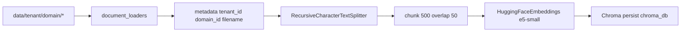

# `rag/vector_store.py` — vector store

**Source:** `rag/vector_store.py`  
**Data:** `data/{tenant_id}/{domain_id}/*.{txt,pdf,docx}`  
**Storage:** `chroma_db/` (Docker volume `chroma_data`)  
**Called by:** `rag/retrieval.py`, admin reindex

---

## Purpose

Core **vector RAG**: documents → embeddings → **Chroma**. No LLM here.

---

## Indexing pipeline



### `rag/document_loaders.py`

| Extension | Loader |
|-----------|--------|
| `.txt` | `TextLoader` (UTF-8) |
| `.pdf` | `PyPDFLoader` |
| `.docx` | `Docx2txtLoader` |

Metadata on each document: `filename`, `domain_id`, `tenant_id`, `source_file`, `file_type`.

---

## `load_all_documents()`

- Discovers KB directories (`data/{tenant}/{domain}/`, legacy `data/{domain}/`)
- Globs supported extensions per domain

---

## `load_vector_store(force_reindex=False)`

| Situation | Behavior |
|-----------|----------|
| RAM cache `_vector_store` | return cached |
| `FORCE_RAG_REINDEX=true` | delete `chroma_db`, rebuild |
| `chroma_db` exists | open Chroma |
| else | `create_vector_store()` |

---

## `search(query, domain_id, tenant_id, k=8)`

```python
store.similarity_search(
    query, k=k, filter={"domain_id": domain_id, "tenant_id": tenant_id}
)
```

---

## Docker

- `./data:/app/data:ro` (python)
- `chroma_data:/app/chroma_db`
- `./data:/app/data` rw (server) — admin upload

After uploading new files — **reindex** required.

---

## Dependencies

`api/requirements.txt`: `langchain-chroma`, `sentence-transformers`, `pypdf`, `docx2txt`.

---

## What to read next

| Topic | File |
|-------|------|
| Domains | [rag-domains_config.md](./rag-domains_config.md) |
| Retrieval | [rag-retrieval.md](./rag-retrieval.md) |
| HTTP reindex | [python-api.md](./python-api.md) |
