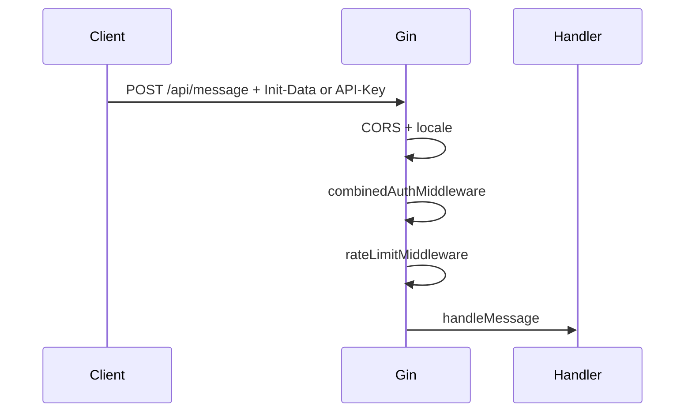

# Authentication and limits (`server/`)

**Files:** `auth_telegram.go`, `api_keys.go`, `auth_combined.go`, `rbac.go`, `admin_users.go`, `middleware.go`, `ratelimit.go`  
**See also:** [webapp-overview.md](./webapp-overview.md) (initData header), [server-overview.md](./server-overview.md) (routes)

---

## Access types in this project

| Type | Who | How |
|------|-----|-----|
| **End user** | Telegram Web App | `X-Telegram-Init-Data` → HMAC validation |
| **Integrator** | HTTP clients, bots | `X-API-Key` (env `API_KEYS` or `API_KEYS_FILE`) |
| **Admin** | Browser `/admin.html` | HTTP Basic, **OIDC SSO**, or `ADMIN_USERS_FILE` (RBAC) |

This article covers **Telegram + API keys + CORS + rate limit**.

---

## `auth_telegram.go` — Telegram validation

### What is `initData`

Query string from Telegram Web App (`user=...&auth_date=...&hash=...`).  
Signed with the bot secret — **cannot be forged without the bot token**.

Docs: [Telegram Web Apps — validating data](https://core.telegram.org/bots/webapps#validating-data-received-via-the-mini-app).

### `validateTelegramInitData(initData, botToken, maxAge)`

1. Parse query, extract `hash`.
2. Build `data_check_string` (remaining fields, sorted).
3. HMAC-SHA256 with key derived from `botToken` + `"WebAppData"`.
4. Compare to `hash` (constant-time `hmac.Equal`).
5. Check `auth_date` — not older than `TELEGRAM_INIT_DATA_MAX_AGE_SEC` (default 86400).
6. Parse `user` JSON → `TelegramUser` (id, name, username, `language_code` for locale).

Tests: `auth_telegram_test.go`.

---

## `api_keys.go` — integrator auth

- Header `X-API-Key` matched against `API_KEYS` or `API_KEYS_FILE`.
- Optional `roles` per key (default `chat_only`). Keys without chat role get **403** on chat routes.
- Used by `combinedAuthMiddleware` together with Telegram auth.
- OpenAPI: `/api/v1/openapi.json` documents API key security.

---

## RBAC (`rbac.go`, `admin_users.go`)

**Roles:** `chat_only`, `kb_editor`, `admin`, `api_manager`.

| Principal | Config | Roles |
|-----------|--------|-------|
| Telegram user | — | implicit `chat_only` |
| API key | `API_KEYS_FILE` | per-key `roles` (default `chat_only`) |
| Admin user | `ADMIN_PASSWORD` or `ADMIN_USERS_FILE` | per-user `roles` |

`admin` is superuser on admin routes. Route guards in `admin.go`; chat API checks API key roles.

Full guide: [config/RBAC.md](../../../config/RBAC.md).

---

## OIDC SSO (`oidc_*.go`, `admin_session.go`)

Optional **OpenID Connect** for admin panel (`OIDC_ENABLED=true`). Chat API still uses Telegram / API keys.

- Login: `GET /api/admin/auth/login`
- Callback: `GET /api/admin/auth/callback`
- Logout: `POST /api/admin/auth/logout`
- Roles from IdP groups/emails → [config/SSO.md](../../../config/SSO.md)

---

## `middleware.go` — CORS

### `corsMiddleware(allowedOrigins)`

- Reads `CORS_ALLOWED_ORIGINS` (comma-separated).
- Reflects allowed Origin in `Access-Control-Allow-Origin`.
- Methods: GET, POST, OPTIONS.
- Headers include: `Content-Type`, `X-Telegram-Init-Data`, `Authorization`, `X-API-Key`, `X-Tenant-ID`, `X-Locale`, `Accept-Language`.
- **OPTIONS** → 204 with empty body.

---

## `combinedAuthMiddleware`

**Dev mode** (`TELEGRAM_AUTH_DISABLED=true`):

- Skips initData validation.
- Sets `telegram_user_id` = 1 (or `X-Dev-User-Id`).
- For smoke tests and local browser.

**Production:**

1. Valid `X-API-Key` → allow (synthetic user id for rate limit).
2. Else: `X-Telegram-Init-Data` or `Authorization: tma <initData>`.
3. Empty → **401** (“open from bot”).
4. Invalid signature → **401**.
5. Success → Gin context: `telegram_user_id`, `telegram_user`.

Handlers use `ctxActorUser(c)` / `ctxTelegramUser(c)`.

---

## Route visibility

**Public (no chat auth):** `/health`, `/ready`, `/domains`, `/onboarding`, `/branding`, `/metrics`

**SaaS (optional, `SAAS_SIGNUP_ENABLED=true`):** `GET /api/v1/plans`, `POST /api/v1/signup`, `POST /api/v1/billing/stripe/checkout`, `POST /api/v1/billing/stripe/webhook` — see [SAAS.md](../SAAS.md)

**Admin:** `/api/admin/*` — Basic, OIDC, or `ADMIN_USERS_FILE` (separate from chat auth)

---

## Protected routes (chat API)

All below use **`auth` + rate limit**:

- `/session`, `/history`, `/message`, `/feedback`
- Mirrors under `/api/...` and `/api/v1/...`

---

## `ratelimit.go` — request limit

### In-memory per user id

- `RATE_LIMIT_REQUESTS_PER_MINUTE` (default 30).
- 1-minute sliding window.
- `0` or negative → disabled.

On exceed: **429** “Too many requests…”.

### Limitation

Single Go process — counters are not shared across replicas (comment in code mentions future Redis).

---

## Request flow (protected)

---

## Common errors

| Symptom | Cause |
|---------|-------|
| 401 on session | no initData/API key, auth not disabled |
| 401 invalid signature | wrong `TELEGRAM_BOT_TOKEN` |
| 401 expired | stale initData — reopen Web App |
| 401 API key | missing or wrong `X-API-Key` |
| 403 API key | key valid but missing `chat_only` role |
| 403 admin | authenticated but insufficient role for route |
| 429 | more than N requests per minute from one user id |

---

## Summary

**auth_telegram** — Telegram cryptography. **api_keys** — integrator access. **middleware** — CORS + locale + auth wrapper. **ratelimit** — spam protection for LLM. Chat and feedback require passing auth.
