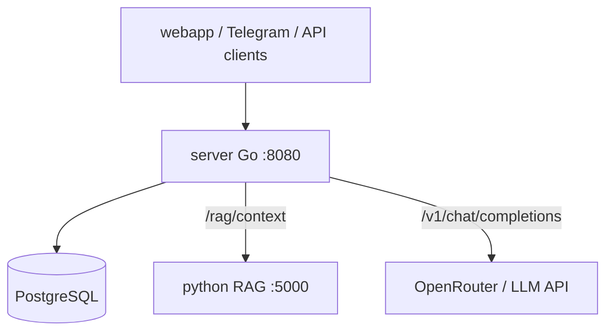

# Go server overview

**Folder:** `server/`  
**Role:** orchestrator — Telegram/API auth, PostgreSQL, Python RAG, LLM, verify  
**Framework:** [Gin](https://gin-gonic.com/)  
**Port:** `8080`

| Article | Topic |
|---------|-------|
| [server-auth-and-limits.md](./server-auth-and-limits.md) | Telegram, API keys, CORS, rate limit |
| [server-chat-and-db.md](./server-chat-and-db.md) | Chat, DB, sessions |
| [server-rag_chat.md](./server-rag_chat.md) | RAG + LLM + streaming |
| [server-admin-and-ux-api.md](./server-admin-and-ux-api.md) | Admin, domains, onboarding |

---

## `server/` files (current)

| File | Purpose |
|------|---------|
| `main.go` | startup, router, migrations |
| `config.go` | config from env |
| `llm.go`, `llm_stream.go` | OpenAI-compatible chat/completions + stream |
| `rag_chat.go`, `rag_pipeline.go` | RAG pipeline, citations |
| `rag_verify.go` | number verify, disclaimer |
| `rag_log.go` | `[RAG]` logs |
| `domains.go` | `domains.json` catalog |
| `locale.go` | `config/locales/{ru,en}`, `X-Locale` |
| `domain_resolve.go` | `domain_id` from query/form |
| `config_paths.go` | config path resolution |
| `domain_guards.go` | `rag_enabled` |
| `message_handlers.go`, `sse.go` | `POST /message`, SSE `?stream=1` |
| `session_handlers.go` | `/session`, `/history` |
| `admin.go`, `admin_feedback.go` | upload, reindex, feedback summary |
| `auth_telegram.go`, `api_keys.go`, `auth_combined.go` | Telegram + API key auth |
| `tenant.go` | `X-Tenant-ID` |
| `middleware.go`, `ratelimit.go` | CORS, limits |
| `postgres_store.go` | SQL, migrations |
| `analytics_store.go`, `feedback.go` | analytics, thumbs up/down |
| `onboarding.go`, `branding.go` | localized UX API |
| `metrics.go`, `request_id.go` | `/metrics`, request IDs |
| `openapi.go` | `/api/v1/openapi.json` |
| `routes.go`, `health.go`, `config_reload.go` | routes, health, hot reload |

**Vision/CV** is outside core; attach via domain pack when needed.

---

## Service diagram

---

## `main()` startup

1. `loadConfig()` — `.env`
2. Postgres + `runAllMigrations`
3. `loadDomainCatalog()`, `initLocaleConfig()`
4. `newChatStore`
5. Gin routes + `localeMiddleware` + `startConfigReloadWatcher`
6. Listen on `:8080`

---

## Key env vars

| Variable | Purpose |
|----------|---------|
| `PYTHON_RAG_URL` | POST retrieval |
| `LLM_API_KEY`, `LLM_MODEL`, `LLM_BASE_URL` | LLM |
| `DATABASE_URL` | Postgres |
| `DATA_DIR` | admin KB upload |
| `DOMAINS_CONFIG_PATH` | domains catalog |
| `LOCALES_ROOT`, `DEFAULT_LOCALE` | i18n bundles |
| `TELEGRAM_BOT_TOKEN` | Web App auth |
| `API_KEYS`, `API_KEYS_FILE` | integrator keys |
| `DEFAULT_TENANT_ID`, `ALLOWED_TENANTS` | multi-tenant |
| `ADMIN_PASSWORD`, `ADMIN_SECRET` | admin |

---

## What to read next

| Topic | File |
|-------|------|
| RAG flow | [server-rag_chat.md](./server-rag_chat.md) |
| Python RAG | [python-api.md](./python-api.md) |
| Docker | [docker-overview.md](./docker-overview.md) |
