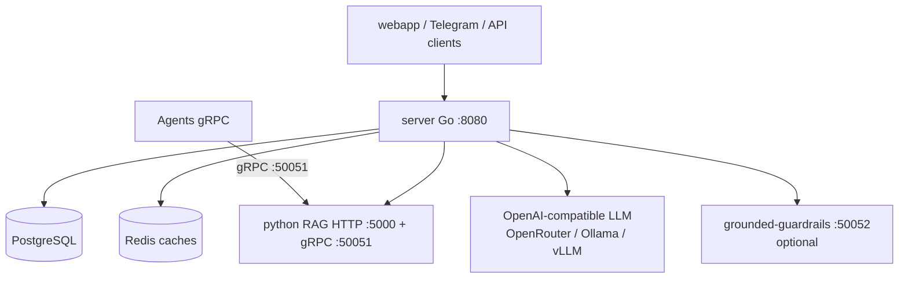

# Go server overview

**Folder:** [`server/`](../../../server/README.md)  
**Role:** orchestrator — Telegram/API auth, PostgreSQL, Python RAG, LLM, verify  
**Framework:** [Gin](https://gin-gonic.com/)  
**Port:** `8080`  
**Build:** `cd server && go build -o main ./cmd/server`

| Article | Topic |
|---------|-------|
| [server-auth-and-limits.md](./server-auth-and-limits.md) | Telegram, API keys, CORS, rate limit |
| [server-chat-and-db.md](./server-chat-and-db.md) | Chat, DB, sessions |
| [server-rag_chat.md](./server-rag_chat.md) | RAG + LLM + streaming |
| [server-admin-and-ux-api.md](./server-admin-and-ux-api.md) | Admin, domains, onboarding |

---

## Package layout (current)

Mature Go layout — strangler extract **complete**. See [`server/README.md`](../../../server/README.md).

| Path | Role |
|------|------|
| `cmd/server` | `main()` → `app.Run()` |
| `internal/app` | composition root: `Run()`, `Deps`, thin `*_bridge.go` |
| `internal/config` | env `Config`, load/validate |
| `internal/store` | `ChatStore`, Postgres, retention |
| `internal/auth` | Telegram initData, API keys, HTTP auth middleware |
| `internal/guardrails` | remote/hybrid gRPC verify client |
| `internal/metrics` | shared Prometheus counters |
| `internal/llm` | OpenAI-compatible chat + stream/cache/mock |
| `internal/rag` | retrieve → prepare → verify → answer |
| `internal/httpapi` | routes, CORS, health/chat/SSE, rate limit, OpenAPI |
| `internal/locale` | locale bundles, branding, onboarding |
| `internal/domain` | domain catalog + RAG guards |
| `internal/tenant` | tenants, quotas, registry |
| `internal/admin` | admin HTTP + RBAC + reindex |
| `internal/oidc` | OIDC SSO |
| `internal/saas` | signup, plans, Stripe |
| `internal/audit` | audit helpers |
| `internal/analytics` | RAG analytics recorder |
| `gen/guardrails/v1` | protobuf stubs for `:50052` |

**Vision/CV** is outside core; attach via domain pack when needed.

---

## Service diagram

```mermaid
flowchart TB
    Web[webapp / Telegram / API clients]
    Agents[Agents gRPC]
    Go[server Go :8080]
    PG[(PostgreSQL)]
    Redis[(Redis caches)]
    Py[python RAG HTTP :5000 + gRPC :50051]
    LLM[OpenAI-compatible LLM\nOpenRouter / Ollama / vLLM]
    GR[grounded-guardrails :50052\noptional]

    Web --> Go
    Agents -->|gRPC :50051| Py
    Go --> PG
    Go --> Redis
    Go --> Py
    Go --> LLM
    Go --> GR
```

See also architecture docs under `docs/en/`.
