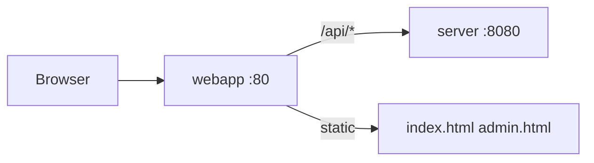

# `webapp/` — Web UI

**Files:** `index.html`, `admin.html`, `app.js`, `app.css`, `nginx.conf`  
**Role:** reference UI for Telegram Web App + admin

---

## Architecture



User opens **http://localhost/** → nginx proxies API to Go.

---

## `index.html` + `app.js` — chat

- Telegram WebApp SDK (`window.Telegram.WebApp`)
- `apiFetch('/api/...')` — all requests via nginx
- Storage: `session_id`, `domain_id`, `locale` (`grounded_llm_*` keys)
- Locale: auto-detect from Telegram `language_code` or browser; header `X-Locale`
- API:
  - `POST /session` `{ domain_id }`
  - `POST /message` `{ session_id, text, domain_id }` — optional `?stream=1` for SSE
  - `GET /history`, `GET /onboarding`, `GET /branding`, `GET /domains`
  - `POST /feedback`

Header `X-Telegram-Init-Data` from Telegram (or dev bypass on server).

---

## `admin.html` — KB admin

- Basic auth → `/api/admin/*`
- Upload: `.txt`, `.pdf`, `.docx` (up to 10 MB)
- List articles, delete, reindex RAG

Domain list from `GET /api/domains` (same as main chat).

---

## `nginx.conf`

- `location /api/` → `proxy_pass http://server:8080/`
- `client_max_body_size 12m`
- timeouts 120s for LLM

---

## Dev without Telegram

```env
TELEGRAM_AUTH_DISABLED=true
```

API directly: `http://localhost:8080` or via `http://localhost/api/`.

---

## Related docs

| Topic | File |
|-------|------|
| Admin API | [server-admin-and-ux-api.md](./server-admin-and-ux-api.md) |
| Docker | [docker-overview.md](./docker-overview.md) |
