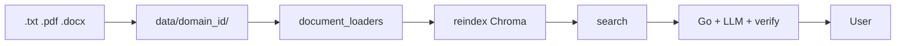

# Пайплайн данных KB / Knowledge base data pipeline

**Цель / Goal:** как документы попадают в RAG и доходят до ответа в чате.

---

## RAG: от документа до ответа



| Этап | Где |
|------|-----|
| Загрузка файла | admin `POST /admin/upload` или git → `data/{domain_id}/` |
| Парсинг | `rag/document_loaders.py` |
| Chunk + embed | `rag/vector_store.py` |
| Retrieval | `POST /rag/context` |
| Ответ | `server/rag_chat.go` |

---

## Поддерживаемые форматы / Supported formats

| Формат | Заметки |
|--------|---------|
| `.txt` | UTF-8 |
| `.pdf` | текстовый слой (PyPDF) |
| `.docx` | Word (docx2txt) |

Имя файла для admin upload: **латиница**, цифры, `_`, `-`, до **10 МБ**.

---

## Шаг 1 — подготовить документы

```
data/default/policy_vacation.txt
data/default/handbook.pdf
data/legal/contract_template.docx
```

Демо-домен `default`: HR policies в `data/default/`.

---

## Шаг 2 — reindex

```bash
python scripts/reindex_rag.py
```

Или admin: `POST /admin/reindex` (Go → Python с `ADMIN_SECRET`).

Без reindex новые файлы **не** попадут в Chroma.

---

## Шаг 3 — проверка

```bash
python scripts/run_rag_eval.py --suite default
```

Или вручную: `POST /rag/context` с `domain_id` и `question`.

---

## CV / Vision (опционально)

Распознавание фото **не входит** в platform core. Для vision подключается отдельный domain pack (свой репозиторий или сервис).

---

## Что читать дальше

| Тема | Файл |
|------|------|
| Admin upload | [server-admin-and-ux-api.md](./server-admin-and-ux-api.md) |
| Vector store | [rag-vector_store.md](./rag-vector_store.md) |
| Deploy | [../DEPLOY.md](../DEPLOY.md) |
