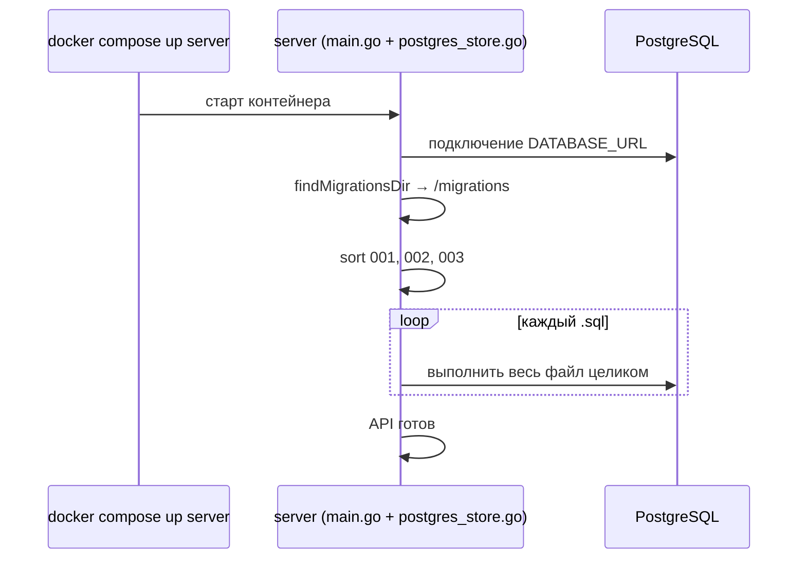

# Разбор: миграции PostgreSQL (`migrations/*.sql`)

**Папка:** `migrations/`  
**Файлы / Files:** `001_init.sql`, `002_domain_id.sql`, `003_feedback_analytics.sql`, `005_message_citations.sql`  
**Кто применяет:** Go-сервер при старте (`server/postgres_store.go` → `runAllMigrations`)  
**СУБД:** PostgreSQL 16 (контейнер `postgres` в `docker-compose.yml`)

---

## Что такое миграция простыми словами

**Миграция** — SQL-скрипт, который **меняет структуру базы данных** (таблицы, колонки, индексы).

Зачем не править БД руками в pgAdmin:

- одна и та же схема у вас, у коллеги и на сервере;
- изменения в Git — видно историю;
- при новом деплое сервер сам накатывает скрипты.

Файлы нумеруются по порядку — это эволюция схемы, а не несколько разных баз.

---

## Как миграции запускаются в этом проекте



### Важные детали

1. Таблица **`schema_migrations`** — каждый `.sql` применяется **один раз**.
2. В скриптах — **`IF NOT EXISTS`** / **`ADD COLUMN IF NOT EXISTS`** на случай ручного восстановления.

### Где лежат файлы в Docker

- `Dockerfile.server`: `COPY migrations /migrations`
- `docker-compose.yml`: `MIGRATIONS_DIR=/migrations`

Локально без Docker Go ищет папку `migrations` или `../migrations`.

---

## Файл `001_init.sql` — фундамент

Три таблицы + связи.

### `users` — кто пишет в чат

| Колонка | Назначение |
|---------|------------|
| `id` | внутренний id в БД |
| `telegram_id` | id из Telegram, **UNIQUE** |
| `username`, `first_name`, `last_name` | профиль |
| `created_at`, `updated_at` | метки времени |

### `chat_sessions` — один «диалог»

| Колонка | Назначение |
|---------|------------|
| `id` | TEXT (случайный hex из Go) |
| `user_id` | → `users.id`, CASCADE при удалении user |
| `created_at`, `updated_at` | когда открыли/обновили сессию |

Индекс `idx_chat_sessions_user_id` — быстро найти все сессии пользователя.

### `messages` — сообщения в сессии

| Колонка | Назначение |
|---------|------------|
| `id` | BIGSERIAL |
| `session_id` | → `chat_sessions.id` |
| `role` | `user` или `assistant` |
| `content` | текст |
| `kind` | тип сообщения |
| `image_token` | ссылка на файл (domain pack / vision) |
| `class_prediction`, `class_confidence` | опционально для vision domain pack |
| `created_at` | порядок в чате |

Индекс `(session_id, created_at)` — история чата по времени.

---

## Файл `002_domain_id.sql` — домен сессии

Добавляет колонку `domain_id` в `chat_sessions`:

```sql
ALTER TABLE chat_sessions
    ADD COLUMN IF NOT EXISTS domain_id TEXT NOT NULL DEFAULT 'default';

CREATE INDEX IF NOT EXISTS idx_chat_sessions_domain_id ON chat_sessions (domain_id);
```

Каждая сессия привязана к knowledge domain из `config/domains.json`.

---

## Файл `003_feedback_analytics.sql` — UX и метрики

### `message_feedback` — 👍 / 👎

| Колонка | Назначение |
|---------|------------|
| `message_id` | → `messages.id`, CASCADE |
| `user_id` | → `users.id` |
| `rating` | `-1` или `1` |
| `UNIQUE (message_id, user_id)` | один голос пользователя на сообщение |

### `analytics_events` — события для статистики

| Колонка | Назначение |
|---------|------------|
| `event_type` | строка-код события |
| `payload` | JSONB |
| `user_id` | опционально, SET NULL если user удалён |

---

## Порядок файлов

```
001_init.sql
002_domain_id.sql
003_feedback_analytics.sql
005_message_citations.sql
```

Go сортирует по имени. **Новая миграция:** `004_что_то.sql` — не менять старые файлы после деплоя.

---

## Как Go использует таблицы

| Таблица | Пример в коде |
|---------|----------------|
| `users` | `UpsertUser` в `postgres_store.go` |
| `chat_sessions` | создание сессии, `domain_id` |
| `messages` | сохранение чата |
| `message_feedback` | `server/feedback.go` |
| `analytics_events` | `server/analytics_store.go` |

---

## Краткий итог

| Файл | Что добавляет |
|------|----------------|
| **001** | users, chat_sessions, messages + индексы |
| **002** | колонка `domain_id` в сессии |
| **003** | message_feedback, analytics_events |
| **005** | `citations JSONB` у сообщений ассистента |

Миграции — **версионированная схема БД на SQL**. Go применяет новые файлы один раз и записывает имя в `schema_migrations`.
