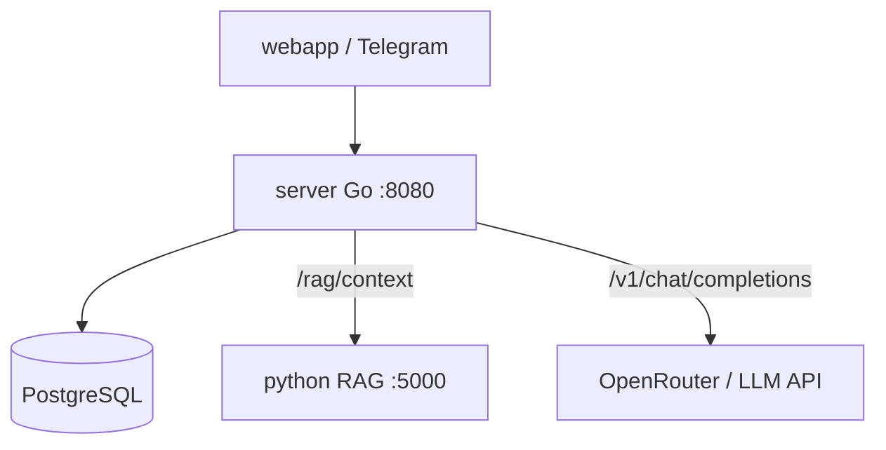

# Разбор: Go-сервер — обзор / Go server overview

**Папка / Folder:** `server/`  
**Роль / Role:** оркестратор — Telegram auth, API, PostgreSQL, Python RAG, LLM, verify  
**Фреймворк / Framework:** [Gin](https://gin-gonic.com/)  
**Порт / Port:** `8080`

| Документ | Тема |
|----------|------|
| [server-auth-and-limits.md](./server-auth-and-limits.md) | Telegram, CORS, rate limit |
| [server-chat-and-db.md](./server-chat-and-db.md) | Чат, БД, сессии |
| [server-rag_chat.md](./server-rag_chat.md) | RAG + LLM + verify |
| [server-admin-and-ux-api.md](./server-admin-and-ux-api.md) | Админка, domains, onboarding |

---

## Файлы `server/` (актуально)

| Файл | Назначение |
|------|------------|
| `main.go` | старт, router, миграции |
| `config.go` | Config из env |
| `llm.go` | OpenAI-compatible chat/completions |
| `rag_chat.go` | RAG pipeline, `POST /chat` (deprecated) |
| `rag_verify.go` | verify чисел, disclaimer |
| `rag_log.go` | логи `[RAG]` |
| `domains.go` | каталог `domains.json`, legacy `crops.json` |
| `domain_resolve.go` | `coalesceDomainID`, query/form helpers |
| `config_paths.go` | поиск конфигов по env и стандартным путям |
| `domain_guards.go` | `rag_enabled` |
| `message_handlers.go` | `POST /message` (текст; фото — только через domain pack) |
| `session_handlers.go` | `/session`, `/history` |
| `admin.go` | upload `.txt/.pdf/.docx`, reindex |
| `auth_telegram.go`, `middleware.go`, `ratelimit.go` | auth, CORS, limits |
| `postgres_store.go` | SQL, миграции |
| `analytics_store.go`, `feedback.go` | analytics, 👍/👎 |
| `onboarding.go`, `branding.go` | UX API |
| `routes.go`, `health.go`, `config_reload.go` | маршруты, health, hot reload |

**Vision/CV** — вне ядра; подключается domain pack при необходимости.

---

## Схема сервисов / Service diagram

---

## Старт `main()`

1. `loadConfig()` — `.env`
2. Postgres + `runAllMigrations`
3. `loadDomainCatalog()`, prompts, onboarding, branding
4. `newChatStore`
5. Gin routes + `startConfigReloadWatcher`
6. `:8080`

---

## Ключевые env

| Переменная | Назначение |
|------------|------------|
| `PYTHON_RAG_URL` | POST retrieval |
| `LLM_API_KEY`, `LLM_MODEL`, `LLM_BASE_URL` | LLM |
| `DATABASE_URL` | Postgres |
| `DATA_DIR` | admin upload KB |
| `DOMAINS_CONFIG_PATH` | domains catalog |
| `TELEGRAM_BOT_TOKEN` | Web App auth |
| `ADMIN_PASSWORD`, `ADMIN_SECRET` | admin |

---

## Legacy API

- JSON поле `crop_id` → то же, что `domain_id`
- `GET /crops` → alias `GET /domains`
- `POST /chat` → deprecated, use `POST /message`

---

## Что читать дальше

| Тема | Файл |
|------|------|
| RAG flow | [server-rag_chat.md](./server-rag_chat.md) |
| Python RAG | [python-api.md](./python-api.md) |
| Docker | [docker-overview.md](./docker-overview.md) |
