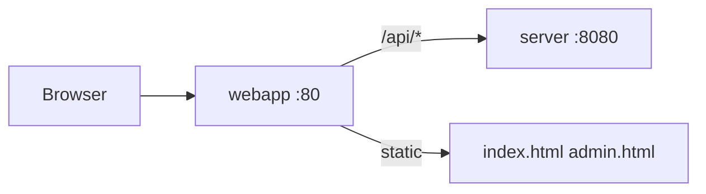

# Разбор: `webapp/` / Web UI

**Файлы / Files:** `index.html`, `admin.html`, `app.js`, `app.css`, `nginx.conf`  
**Роль / Role:** reference UI для Telegram Web App + admin

---

## Архитектура / Architecture



Пользователь открывает **http://localhost/** → nginx проксирует API на Go.

---

## `index.html` + `app.js` — чат

- Telegram WebApp SDK (`window.Telegram.WebApp`)
- `apiFetch('/api/...')` — все запросы через nginx
- Storage: `session_id`, `domain_id` (legacy keys содержат `grounded_llm_*`)
- API:
  - `POST /session` `{ domain_id }`
  - `POST /message` `{ session_id, text, domain_id }`
  - `GET /history`, `GET /onboarding`, `GET /branding`, `GET /domains`
  - `POST /feedback`

Header `X-Telegram-Init-Data` — из Telegram (или dev bypass на server).

---

## `admin.html` — админка KB

- Basic auth → `/api/admin/*`
- Upload: `.txt`, `.pdf`, `.docx` (до 10 МБ)
- List articles, reindex RAG

> **Note:** список доменов загружается из `GET /api/domains` (как в основном чате).

---

## `nginx.conf`

- `location /api/` → `proxy_pass http://server:8080/`
- `client_max_body_size 12m`
- timeouts 120s для LLM

---

## Dev без Telegram

```env
TELEGRAM_AUTH_DISABLED=true
```

API напрямую: `http://localhost:8080` или через `http://localhost/api/`.

---

## Связанные docs

| Тема | Файл |
|------|------|
| Admin API | [server-admin-and-ux-api.md](./server-admin-and-ux-api.md) |
| Docker | [docker-overview.md](./docker-overview.md) |
