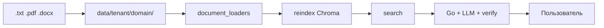

# Пайплайн данных базы знаний

**Цель:** как документы попадают в RAG и доходят до ответа в чате.

---

## От файла до ответа



| Этап | Где |
|------|-----|
| Загрузка | admin `POST /admin/upload` или git → `data/{tenant_id}/{domain_id}/` |
| Парсинг | `rag/document_loaders.py` |
| Chunk + embed | `rag/vector_store.py` |
| Retrieval | `POST /rag/context` |
| Ответ | `server/rag_pipeline.go` |

---

## Поддерживаемые форматы

| Формат | Заметки |
|--------|---------|
| `.txt` | UTF-8 |
| `.pdf` | Текстовый слой (PyPDF) |
| `.docx` | Word (docx2txt) |

Имя для admin upload: **латиница**, цифры, `_`, `-`, до **10 МБ**.

---

## Шаг 1 — подготовить документы

```
data/default/default/policy_vacation.txt
data/default/default/handbook.pdf
data/acme/legal/contract.docx
```

Демо HR: `data/default/default/` (legacy `data/default/` тоже работает).

---

## Шаг 2 — reindex

```bash
python scripts/reindex_rag.py
```

Или admin: `POST /admin/reindex`.

Без reindex новые файлы **не** попадут в Chroma.

---

## Шаг 3 — проверка

```bash
python scripts/run_rag_eval.py --suite default
```

Или `POST /rag/context` с `domain_id`, `tenant_id`, `locale`, `question`.

---

## Vision (опционально)

Распознавание фото **не входит** в ядро — отдельный domain pack.

---

## Дальше

| Тема | Файл |
|------|------|
| Admin | [server-admin-and-ux-api.md](./server-admin-and-ux-api.md) |
| Chroma | [rag-vector_store.md](./rag-vector_store.md) |
| Deploy | [../DEPLOY.md](../DEPLOY.md) |
