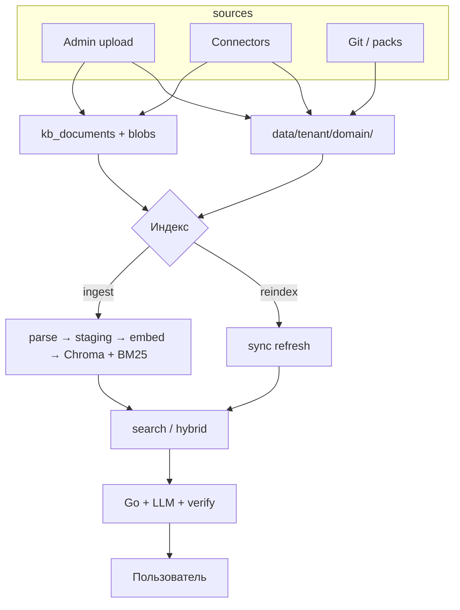

# Пайплайн данных базы знаний

**Цель:** как документы попадают в RAG и доходят до ответа в чате.

Подробно (async ingest): [INGESTION.md](../INGESTION.md) · registry: [KB_SOURCE_OF_TRUTH.md](../KB_SOURCE_OF_TRUTH.md) · legacy reindex: [config/REINDEX.md](../../config/REINDEX.md)

---

## Два пути индексации

| Путь | Когда |
|------|--------|
| **Ingest pipeline** | Прод: job в Postgres, parse → embed → index, status API |
| **Reindex** | Dev/CI: один синхронный прогон (`reindex_rag.py`, `POST /admin/reindex`) |

Оба используют одни и те же loaders, chunker, embeddings и manifest/sha1 в Chroma.

---

## От файла до ответа


```mermaid
flowchart TB
    subgraph sources
        U[Admin upload]
        C[Connectors]
        G[Git / packs]
    end
    U --> REG[kb_documents + blobs]
    C --> REG
    G --> D[data/tenant/domain/]
    U --> D
    C --> D
    REG --> I{Индекс}
    D --> I
    I -->|ingest| P[parse → staging → embed → Chroma + BM25]
    I -->|reindex| R[sync refresh]
    P --> S[search / hybrid]
    R --> S
    S --> A[Go + LLM + verify]
    A --> User[Пользователь]
```

| Этап | Где |
|------|-----|
| **Source of truth** | Postgres `kb_documents` + blobs — [KB_SOURCE_OF_TRUTH.md](../KB_SOURCE_OF_TRUTH.md) |
| Legacy `data/` | upload / connectors / git (dual-write) |
| **Ingest** | `POST /admin/ingest` → registry discover → Redis → `ingest-worker` |
| **Reindex** | `scripts/reindex_rag.py` или `POST /admin/reindex` |
| Парсинг | `rag/document_loaders.py` |
| Chunk | `rag/indexing.py` (500/50) |
| Embed | e5-small + Redis cache |
| Dense | Chroma / Qdrant / pgvector |
| Sparse | BM25 при `hybrid` |
| Retrieval | `POST /rag/context` |
| Ответ | `internal/rag/pipeline.go` |

---

## Ingest (рекомендуется для admin)

```bash
curl -u admin:pass -X POST "http://localhost:8080/api/admin/ingest?domain_id=default" \
  -H "Content-Type: application/json" \
  -d '{"sync": false}'

curl -u admin:pass "http://localhost:8080/api/admin/ingest/status?job_id=1"
```

Пустой `files` = все файлы домена. Статусы: `queued → parsing → embedding → indexing → succeeded | failed | partial`.

См. [INGESTION.md](../INGESTION.md).

---

## Форматы

`.txt`, `.pdf`, `.docx` — до 10 МБ, латиница в имени upload.

---

## Шаг 1 — документы

**Prod:** upload (registry + blob + `data/`) или connector + `python scripts/backfill_kb_registry.py` для старых файлов.

**Dev:** файлы в `data/`, затем backfill или ingest:

```
data/default/default/vacation_policy_en.txt
```

---

## Шаг 2 — индекс

**Прод:** `docker compose up -d ingest-worker` + `POST /admin/ingest`

**Dev/CI:** `python scripts/reindex_rag.py`

Без индексации новые файлы **не** попадут в Chroma.

---

## Шаг 3 — проверка

```bash
python scripts/run_rag_eval.py --suite default
```

---

## Дальше

| Тема | Файл |
|------|------|
| Source of truth | [KB_SOURCE_OF_TRUTH.md](../KB_SOURCE_OF_TRUTH.md) |
| Ingestion | [INGESTION.md](../INGESTION.md) |
| Admin API | [server-admin-and-ux-api.md](./server-admin-and-ux-api.md) |
| Connectors | [CONNECTORS.md](../CONNECTORS.md) |
