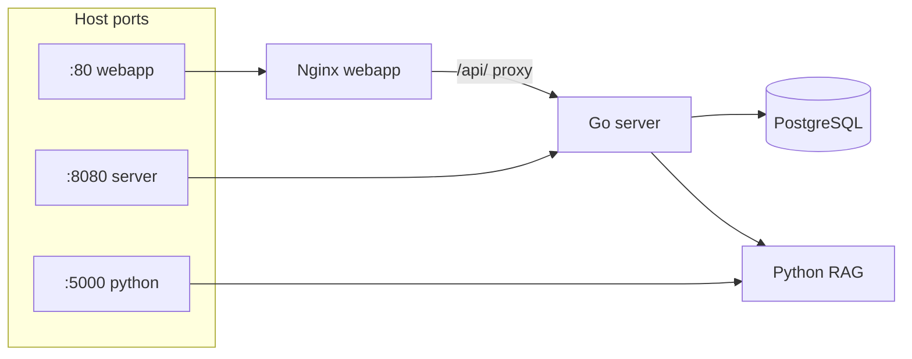

# Docker и локальный запуск

**Файлы:** `docker-compose.yml`, `Dockerfile.server`, `Dockerfile.python`, `Dockerfile.webapp`, `.env`  
**См. также:** [server-overview.md](./server-overview.md), [webapp-overview.md](./webapp-overview.md)

---

## Четыре сервиса



| Сервис | Образ | Роль |
|------------------|---------------|-------------|
| **postgres** | `postgres:16-alpine` | users, sessions, messages, feedback, analytics |
| **python** | `Dockerfile.python` | Flask: RAG retrieval, reindex, `/health` |
| **server** | `Dockerfile.server` | API, LLM orchestration, verify, admin |
| **webapp** | `Dockerfile.webapp` | Эталонный UI (Telegram Web App) + nginx → server |

Имя проекта Compose: **`grounded_llm`**

---

## Быстрый старт

```bash
cp .env.example .env   # LLM_API_KEY, ADMIN_PASSWORD, TELEGRAM_BOT_TOKEN
docker compose up -d --build
python scripts/reindex_rag.py   # или POST /admin/reindex
```

Полезные команды:

```bash
docker compose ps
docker compose logs -f server
docker compose logs -f python
docker compose restart server
docker compose up -d --force-recreate server
docker compose down
docker compose down -v   # удалит volumes: БД, chroma, uploads!
```

Makefile: `make up`, `make logs`, `make smoke`, `make test`.

---

## Volumes

| Volume | Контейнер | Содержимое |
|--------|-----------|------------|
| `postgres_data` | postgres | схема и данные чата |
| `chroma_data` | python `/app/chroma_db` | индекс RAG (Chroma) |
| `uploads_data` | server `/data/uploads` | зарезервировано под медиа domain pack |

**Bind mount с хоста:**

| Хост | Контейнер | Назначение |
|------|-----------|------------|
| `./data` | python `:ro`, server `/app/data` rw | документы KB (`.txt`, `.pdf`, `.docx`) |
| `./config` | server + python `/config:ro` | domains, locales (`/config/locales`) |
| `./api`, `./rag` | python `:ro` | dev без rebuild образа |
| `./webapp/*` | webapp | UI без rebuild |

---

## Сервис `postgres`

- User / password / db: `grounded` / `grounded` / `grounded`
- `DATABASE_URL` в server совпадает с compose
- Healthcheck `pg_isready` — server стартует после БД

---

## Сервис `python` (RAG)

- Порт **5000**, entrypoint: `python api/app.py`
- Env: `DOMAINS_CONFIG_PATH`, `LOCALES_ROOT`, `DEFAULT_LOCALE`, `ADMIN_SECRET`, `FORCE_RAG_REINDEX`, `PYTHON_SERVICE_PORT`
- Healthcheck: `start_period: 180s` (первый RAG / embeddings может быть долгим)
- Endpoints: `/health`, `/rag/context`, `/domains`, `/admin/reindex`

Первый запрос RAG может скачивать embedding-модель `intfloat/multilingual-e5-small`.

---

## Сервис `server`

- Порт **8080**
- Зависит от healthy `postgres` + `python`
- В образе: бинарник `main`, `/migrations`, `/config` (runtime override через volume)
- `DATA_DIR=/app/data` — admin upload документов
- `MIGRATIONS_DIR=/migrations` — SQL при старте
- `LOCALES_ROOT=/config/locales`, `DEFAULT_LOCALE`

Dev без Telegram:

```env
TELEGRAM_AUTH_DISABLED=true
```

---

## Сервис `webapp`

- Порт **80** → http://localhost/
- `index.html` — чат, `admin.html` — админка
- `location /api/` → proxy `http://server:8080/`

---

## Сеть между контейнерами

| Из | URL |
|----|-----|
| server | `http://python:5000/rag/context` |
| webapp nginx | `http://server:8080` |
| server | `postgres:5432` |

С хоста: `localhost:8080` (Go напрямую), `localhost/api/` (через nginx).

---

## Образы (Dockerfiles)

| Файл | База | Заметки |
|------|------|---------|
| `Dockerfile.server` | `golang:1.23-alpine` → `alpine:3.21` | multi-stage, `curl` для healthcheck |
| `Dockerfile.python` | `python:3.11-slim` | RAG deps из `api/requirements.txt` |
| `Dockerfile.webapp` | `nginx:alpine` | статика + `nginx.conf` |

---

## Типичные проблемы

| Проблема | Решение |
|----------|---------|
| python unhealthy 2–3 мин | норма при первом старте; смотреть `docker compose logs python` |
| server unhealthy | ждать postgres/python; `docker compose logs server` |
| Новые документы не в RAG | upload + `POST /admin/reindex` или `scripts/reindex_rag.py` |
| Изменения `config/` | volume `./config`; Go: `docker compose kill -s HUP server` или `CONFIG_RELOAD_INTERVAL_SEC` |
| 401 в чате | `TELEGRAM_AUTH_DISABLED=true` + recreate server |
| Старый образ после правок Python | `docker compose build --no-cache python && docker compose up -d --force-recreate python server` |

---

## CI vs локальный Docker

GitHub Actions собирает все три образа (`server`, `webapp`, `python`), но **не** поднимает полный compose. См. [github-ci.yml.md](./github-ci.yml.md).
