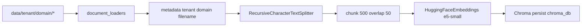

# `rag/vector_store.py` — векторное хранилище

**Исходник:** `rag/vector_store.py`  
**Данные:** `data/{tenant_id}/{domain_id}/*.{txt,pdf,docx}`  
**Хранилище:** `chroma_db/` (Docker volume `chroma_data`)  
**Вызывают:** `rag/retrieval.py`, admin reindex

---

## Назначение

Ядро **векторного RAG**: документы → embeddings → **Chroma**. LLM здесь нет.

---

## Пайплайн индексации



### `rag/document_loaders.py`

| Расширение | Loader |
|------------|--------|
| `.txt` | `TextLoader` (UTF-8) |
| `.pdf` | `PyPDFLoader` |
| `.docx` | `Docx2txtLoader` |

Metadata: `filename`, `domain_id`, `tenant_id`, `source_file`, `file_type`.

---

## `load_all_documents()`

- Обходит каталоги KB (`data/{tenant}/{domain}/`, legacy `data/{domain}/`)
- Glob по поддерживаемым расширениям

---

## `load_vector_store(force_reindex=False)`

| Ситуация | Поведение |
|----------|-----------|
| RAM-кэш | вернуть кэш |
| `FORCE_RAG_REINDEX=true` | удалить `chroma_db`, пересоздать |
| `chroma_db` есть | открыть Chroma |
| иначе | `create_vector_store()` |

---

## `search(query, domain_id, tenant_id, k=8)`

```python
store.similarity_search(
    query, k=k, filter={"domain_id": domain_id, "tenant_id": tenant_id}
)
```

---

## Docker

- `./data:/app/data:ro` (python)
- `chroma_data:/app/chroma_db`
- `./data:/app/data` rw (server) — admin upload

После upload — **обязателен reindex**.

---

## Зависимости

`api/requirements.txt`: `langchain-chroma`, `sentence-transformers`, `pypdf`, `docx2txt`.

---

## Дальше

| Тема | Файл |
|------|------|
| Домены | [rag-domains_config.md](./rag-domains_config.md) |
| Retrieval | [rag-retrieval.md](./rag-retrieval.md) |
| HTTP reindex | [python-api.md](./python-api.md) |
