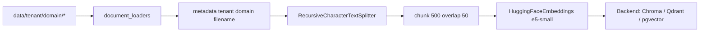

# `rag/vector_store.py` — векторное хранилище

**Исходники:** `rag/vector_store.py`, `rag/vector_backend/` (Chroma / Qdrant / pgvector), `rag/indexing.py`, `rag/sparse_index.py`  
**Данные:** `data/{tenant_id}/{domain_id}/*.{txt,pdf,docx}`  
**Ops-гайд (env):** [../VECTOR_STORE.md](../VECTOR_STORE.md) · [EN](../../en/VECTOR_STORE.md)  
**Вызывают:** `rag/retrieval.py`, admin reindex, `scripts/reindex_rag.py`

---

## Назначение

Ядро **векторного RAG**: документы → embeddings → выбранный backend. LLM здесь нет.  
Backend выбирается через `VECTOR_STORE=chroma|qdrant|pgvector` (по умолчанию Chroma).

---

## Пайплайн индексации


```mermaid
flowchart LR
    A[data/tenant/domain/*] --> B[document_loaders]
    B --> C[metadata tenant domain filename]
    C --> D[RecursiveCharacterTextSplitter]
    D --> E[chunk 500 overlap 50]
    E --> F[HuggingFaceEmbeddings e5-small]
    F --> G[Backend: Chroma / Qdrant / pgvector]
```

### `rag/document_loaders.py`

| Расширение | Loader |
|------------|--------|
| `.txt` | `TextLoader` (UTF-8) |
| `.pdf` | `PyPDFLoader` |
| `.docx` | `Docx2txtLoader` |

Metadata: `filename`, `domain_id`, `tenant_id`, `source_file`, `file_type`.

---

## Бэкенды (`rag/vector_backend/`)

| Backend | Persist | Когда выбирать |
|---------|---------|----------------|
| **Chroma** | `chroma_db/` (volume `chroma_data`) | Compose / CI / локальная разработка |
| **Qdrant** | managed Qdrant (`QDRANT_URL`) | отдельный vector DB |
| **pgvector** | Postgres (`009_pgvector.sql`) | один Postgres для сессий + векторов |

Смена backend или модели эмбеддингов → **полный reindex** + прогон eval.

```bash
# Chroma (default)
VECTOR_STORE=chroma python scripts/reindex_rag.py

# Qdrant
pip install -r api/requirements-qdrant.txt
VECTOR_STORE=qdrant QDRANT_URL=http://127.0.0.1:6333 FORCE_RAG_REINDEX=true python scripts/reindex_rag.py

# pgvector
pip install -r api/requirements-pgvector.txt
VECTOR_STORE=pgvector FORCE_RAG_REINDEX=true python scripts/reindex_rag.py
```

---

## Hybrid retrieval (BM25 + dense + RRF)

При `RAG_RETRIEVAL_MODE=hybrid`:

1. dense hits из vector backend  
2. BM25 hits из `sparse_index/` (`SPARSE_INDEX_DIR`)  
3. слияние RRF (`RAG_RRF_K`, default 60)  
4. опциональный rerank: `RAG_RERANKER=keyword|cross_encoder`

Подробнее: [../VECTOR_STORE.md](../VECTOR_STORE.md).

---

## `load_vector_store(force_reindex=False)`

| Ситуация | Поведение |
|----------|-----------|
| RAM-кэш | вернуть кэш |
| `FORCE_RAG_REINDEX=true` | пересоздать индекс backend |
| иначе | открыть существующий / создать |

---

## `search(query, domain_id, tenant_id, k=8)`

Фильтр metadata **всегда** `domain_id` + `tenant_id` — изоляция workspace.

---

## Docker

- `./data:/app/data:ro` (python)
- `chroma_data:/app/chroma_db` (если Chroma)
- `./data:/app/data` rw (server) — admin upload
- после upload — **обязателен reindex**

---

## Зависимости

| Backend | Файл |
|---------|------|
| Chroma (default) | `api/requirements.txt` |
| Qdrant | `api/requirements-qdrant.txt` |
| pgvector | `api/requirements-pgvector.txt` |

---

## Дальше

| Тема | Файл |
|------|------|
| Env / hybrid / rerank | [../VECTOR_STORE.md](../VECTOR_STORE.md) |
| Домены | [rag-domains_config.md](./rag-domains_config.md) |
| Retrieval HTTP | [rag-retrieval.md](./rag-retrieval.md) |
| Python API | [python-api.md](./python-api.md) |
