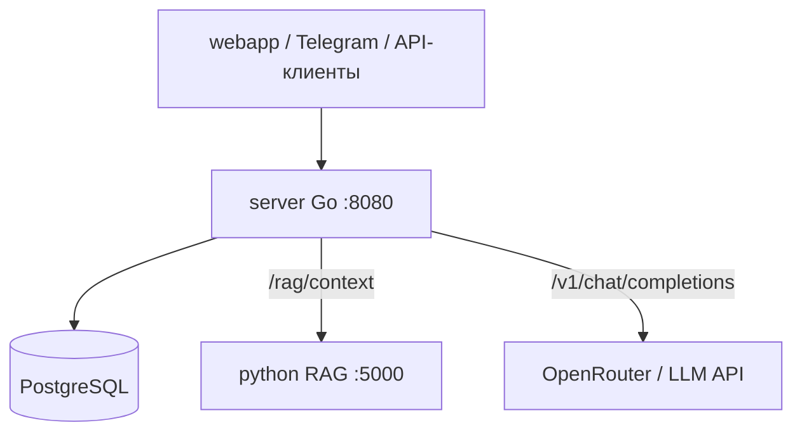

# Go-сервер — обзор

**Папка:** `server/`  
**Роль:** оркестратор — авторизация, API, PostgreSQL, Python RAG, LLM, verify  
**Фреймворк:** [Gin](https://gin-gonic.com/)  
**Порт:** `8080`

| Документ | Тема |
|----------|------|
| [server-auth-and-limits.md](./server-auth-and-limits.md) | Telegram, API keys, CORS, лимиты |
| [server-chat-and-db.md](./server-chat-and-db.md) | Чат, БД, сессии |
| [server-rag_chat.md](./server-rag_chat.md) | RAG + LLM + streaming |
| [server-admin-and-ux-api.md](./server-admin-and-ux-api.md) | Админка, domains, onboarding |

---

## Файлы `server/` (актуально)

| Файл | Назначение |
|------|------------|
| `main.go` | Старт, router, миграции |
| `config.go` | Настройки из env |
| `llm.go`, `llm_stream.go` | OpenAI-compatible API + поток |
| `rag_chat.go`, `rag_pipeline.go` | RAG, citations |
| `rag_verify.go` | Проверка чисел, дисклеймер |
| `rag_log.go` | Логи `[RAG]` |
| `domains.go` | Каталог `domains.json` |
| `locale.go` | `config/locales/{ru,en}`, middleware `X-Locale` |
| `domain_resolve.go` | `domain_id` из query/form |
| `domain_guards.go` | Флаг `rag_enabled` |
| `message_handlers.go`, `sse.go` | `POST /message`, SSE `?stream=1` |
| `session_handlers.go` | `/session`, `/history` |
| `admin.go`, `admin_feedback.go` | Upload, reindex, сводка feedback |
| `auth_telegram.go`, `api_keys.go`, `auth_combined.go` | Telegram + API key |
| `tenant.go` | `X-Tenant-ID` |
| `middleware.go`, `ratelimit.go` | CORS, лимиты |
| `postgres_store.go` | SQL, миграции |
| `metrics.go`, `request_id.go` | `/metrics`, request ID |
| `openapi.go` | `/api/v1/openapi.json` |
| `onboarding.go`, `branding.go` | Локализованный UX API |
| `routes.go`, `health.go`, `config_reload.go` | Маршруты, health, hot reload |

**Vision/CV** — вне ядра; подключается domain pack при необходимости.

---

## Схема сервисов

---

## Старт `main()`

1. `loadConfig()` — `.env`
2. Postgres + `runAllMigrations`
3. `loadDomainCatalog()`, `initLocaleConfig()`
4. `newChatStore`
5. Gin routes + `localeMiddleware` + `startConfigReloadWatcher`
6. Слушает `:8080`

---

## Ключевые переменные окружения

| Переменная | Назначение |
|------------|------------|
| `PYTHON_RAG_URL` | POST retrieval |
| `LLM_API_KEY`, `LLM_MODEL`, `LLM_BASE_URL` | LLM |
| `DATABASE_URL` | Postgres |
| `DATA_DIR` | Upload документов KB |
| `DOMAINS_CONFIG_PATH` | Каталог доменов |
| `LOCALES_ROOT`, `DEFAULT_LOCALE` | Локали |
| `TELEGRAM_BOT_TOKEN` | Web App auth |
| `API_KEYS`, `API_KEYS_FILE` | Ключи интеграторов |
| `DEFAULT_TENANT_ID`, `ALLOWED_TENANTS` | Мультитенантность |
| `ADMIN_PASSWORD`, `ADMIN_SECRET` | Админка |

---

## Что читать дальше

| Тема | Файл |
|------|------|
| RAG | [server-rag_chat.md](./server-rag_chat.md) |
| Python RAG | [python-api.md](./python-api.md) |
| Docker | [docker-overview.md](./docker-overview.md) |
