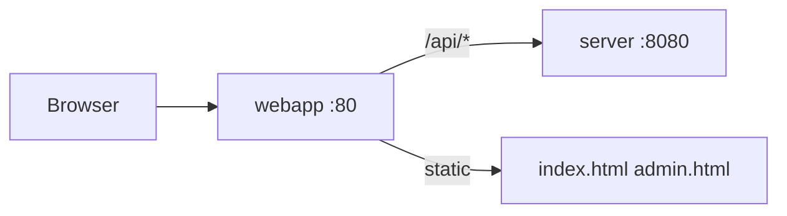

# `webapp/` — веб-интерфейс

**Файлы:** `index.html`, `admin.html`, `signup.html`, `embed.html`, `app.js`, `app.css`, `nginx.conf`  
**Роль:** эталонный UI — чат, админка KB, опциональный SaaS signup, embed-виджет

---

## Архитектура



Пользователь открывает **http://localhost/** → nginx проксирует API на Go.

---

## `index.html` + `app.js` — чат

- Telegram WebApp SDK
- `apiFetch('/api/...')` — все запросы через nginx
- localStorage/sessionStorage: `session_id`, `domain_id`, **`locale`**
- Язык: из Telegram `language_code` или браузера; заголовок `X-Locale`
- API:
  - `POST /session` `{ domain_id }`
  - `POST /message` — опционально `?stream=1` (SSE)
  - `GET /history`, `GET /onboarding`, `GET /branding`, `GET /domains`
  - `POST /feedback`

Заголовок `X-Telegram-Init-Data` — из Telegram (или dev bypass на сервере).

---

## `admin.html` — админка KB

- Basic auth → `/api/admin/*`
- Upload: `.txt`, `.pdf`, `.docx` (до 10 МБ)
- Список статей, удаление, reindex

Список доменов: `GET /api/domains`.

---

## `signup.html` — опциональный SaaS signup

- `GET /api/v1/plans`, `POST /api/v1/signup`
- Ответ: tenant id, опционально admin credentials и Stripe `checkout_url`
- Сервер: `SAAS_SIGNUP_ENABLED=true`, `TENANTS_REGISTRY_FILE` — [SAAS.md](../SAAS.md)

---

## `embed.html` — виджет для intranet

Встраиваемый чат для партнёрских сайтов. См. [EMBED.md (EN)](../../en/EMBED.md).

---

## `nginx.conf`

- `location /api/` → `proxy_pass http://server:8080/`
- `client_max_body_size 12m`
- timeouts 120s для LLM

---

## Разработка без Telegram

```env
TELEGRAM_AUTH_DISABLED=true
```

API: `http://localhost:8080` или `http://localhost/api/`.

---

## Связанные статьи

| Тема | Файл |
|------|------|
| Admin API | [server-admin-and-ux-api.md](./server-admin-and-ux-api.md) |
| Docker | [docker-overview.md](./docker-overview.md) |
